# The TABenchmark Model Compendium

*What every model in the benchmark is, and — the point of this document — what each one does **differently** from what came before.* Fifty years of traffic assignment is not a pile of interchangeable solvers; it is an evolutionary tree, each node answering a shortcoming of its parent. This compendium is the field guide; the [evolution graph](#the-evolution-of-traffic-assignment) is the map.

Every model is read through TABenchmark's **P1 lens**: the harness recomputes the scored metric from emitted link flows, so "what it does differently" is always graded on the same certificate (see [ARCHITECTURE.md](ARCHITECTURE.md), [VALIDATION.md](VALIDATION.md)). Entries marked **shipped** run today; **roadmap** entries are queued in [ROADMAP.md](ROADMAP.md) / `TASKS.md`. Grounded in the verified [reference canon](REFERENCES.md) and the Boyles/Lownes/Unnikrishnan *Transportation Network Analysis* text.

## The evolution of traffic assignment

The trunk runs **principle → program → cost → solver**: Wardrop (1952) stated *what* equilibrium is, Beckmann (1956) turned it into a convex program *solvable* in principle, the BPR curve (1964) gave it a differentiable cost, and Frank–Wolfe/LeBlanc (1956/1975) made it *computable*. Everything else is a branch off that trunk, each driven by a specific limitation:

- **the convergence race** (link → conjugate → path → bush): Frank–Wolfe's slow tail drove conjugate FW, then path-based gradient projection, then the origin/bush-based family (OBA → Algorithm B → TAPAS) that reaches machine-precision equilibria.
- **perception** (stochastic UE): drivers don't see true costs, so Dial's STOCH, Fisk's logit, and the Daganzo–Sheffi/Sheffi–Powell probit line replaced the sharp min with a choice model.
- **the planner's view** (SO & pricing): Beckmann's marginal-cost transform, Yang–Huang tolls, and Roughgarden–Tardos' price of anarchy quantified the cost of selfish routing.
- **relaxing assumptions** (static extensions): elastic demand (Florian–Nguyen), combined distribution+assignment (Evans), bounded rationality, and side constraints loosened the fixed-demand, perfectly-rational, uncapacitated idealization.
- **adding time** (dynamics): day-to-day systems (Smith, Horowitz, Cascetta) asked whether equilibrium is even reached; dynamic network loading (LWR → CTM → LTM → node models) and analytical DTA (Vickrey → Merchant–Nemhauser → Friesz → Ziliaskopoulos) put congestion in motion.
- **assignment as a function** (learned): Rahman–Hasan regress flows, Liu et al. enforce the fixed point inside the network, Liu–Meidani generalize across topologies — trading the equilibrium guarantee for speed, which P1 is built to audit.

```mermaid
graph TD
  n_wardropsome7476["Wardrop 1952"]:::c0
  n_frankalgorithm6385(["Frank 1956"]):::c1
  n_beckmannstudies2645(["Beckmann 1956"]):::c4
  n_bprtraffic563(["Bureau of Public Roads (BPR) 1964"]):::c0
  n_vickreycongestion3141["Vickrey 1969"]:::c8
  n_dialprobabilistic5178(["Dial 1971"]):::c3
  n_dafermostraffic7276(["Dafermos 1972"]):::c0
  n_florianmethod9428(["Florian 1974"]):::c5
  n_leblancefficient294(["LeBlanc 1975"]):::c1
  n_evansderivation1705(["Evans 1976"]):::c5
  n_daganzostochastic1939(["Daganzo 1977"]):::c3
  n_merchantmodel1560["Merchant 1978"]:::c8
  n_smithexistence5776["Smith 1979"]:::c0
  n_dafermostraffic4000(["Dafermos 1980"]):::c0
  n_fisksome1742(["Fisk 1980"]):::c3
  n_vanzuylenmost4944(["Van Zuylen 1980"]):::c10
  n_powellconvergence3924(["Powell 1982"]):::c3
  n_sheffialgorithm5137(["Sheffi 1982"]):::c3
  n_horowitzstability3163(["Horowitz 1984"]):::c6
  n_smithstability798(["Smith 1984"]):::c6
  n_cascettaestimation8745(["Cascetta 1984"]):::c10
  n_sheffiurban8618(["Sheffi (MSA baseline; convergence proof Powell 1985"]):::c1
  n_mahmassanion4858(["Mahmassani 1987"]):::c5
  n_spiessoptimal3658(["Spiess 1989"]):::c5
  n_cascettastochastic3881(["Cascetta 1989"]):::c6
  n_spiessgradient8815(["Spiess 1990"]):::c10
  n_spallmultivariate5410(["Spall 1992"]):::c10
  n_yangestimation3439(["Yang 1992"]):::c10
  n_newellsimplified1633["Newell 1993"]:::c7
  n_frieszvariational9239["Friesz 1993"]:::c8
  n_cascettadynamic7177["Cascetta 1993"]:::c10
  n_jayakrishnanfaster1323(["Jayakrishnan 1994"]):::c2
  n_frieszdaytoday4558(["Friesz 1994"]):::c6
  n_daganzocell7244(["Daganzo 1994"]):::c7
  n_larssonaugmented3883(["Larsson 1995"]):::c5
  n_cantarelladynamic9699(["Cantarella 1995"]):::c6
  n_daganzocell6348["Daganzo 1995"]:::c7
  n_lebacquegodunov3835["Lebacque 1996"]:::c7
  n_yangprinciple7580(["Yang 1998"]):::c4
  n_ziliaskopouloslinear4836["Ziliaskopoulos 2000"]:::c8
  n_bargeraorigin7268(["Bar-Gera 2002"]):::c2
  n_roughgardenhow4698(["Roughgarden 2002"]):::c4
  n_boyceconvergence3048["Boyce 2004"]:::c10
  n_dialpath6641(["Dial 2006"]):::c2
  n_ypermanlink2548(["Yperman 2007"]):::c7
  n_balakrishnaoffline5342["Balakrishna 2007"]:::c10
  n_bargeratraffic2251(["Bar-Gera 2010"]):::c2
  n_helinkbased819(["He 2010"]):::c6
  n_tamperegeneric261["Tampère 2011"]:::c7
  n_mitradjievastiff2393(["Mitradjieva 2013"]):::c1
  n_smithrouteswapping5343(["Smith 2016"]):::c6
  n_stablertransportation4212["Stabler 2016"]:::c10
  n_liuend1327["Liu 2023"]:::c9
  n_rahmandata5640(["Rahman 2023"]):::c9
  n_eckmansimopt7144["Eckman 2023"]:::c10
  n_liuend3254["Liu 2024"]:::c9
  n_xuunified4096["Xu 2024"]:::c9
  n_ryubomob4703["Ryu 2025"]:::c10
  n_beckmannstudies2645 --> n_dafermostraffic7276
  n_wardropsome7476 --> n_smithexistence5776
  n_beckmannstudies2645 --> n_smithexistence5776
  n_smithexistence5776 --> n_dafermostraffic4000
  n_beckmannstudies2645 --> n_dafermostraffic4000
  n_dafermostraffic7276 --> n_dafermostraffic4000
  n_frankalgorithm6385 --> n_leblancefficient294
  n_beckmannstudies2645 --> n_leblancefficient294
  n_beckmannstudies2645 --> n_sheffiurban8618
  n_leblancefficient294 --> n_mitradjievastiff2393
  n_frankalgorithm6385 --> n_mitradjievastiff2393
  n_leblancefficient294 --> n_jayakrishnanfaster1323
  n_jayakrishnanfaster1323 --> n_bargeraorigin7268
  n_beckmannstudies2645 --> n_bargeraorigin7268
  n_bargeraorigin7268 --> n_dialpath6641
  n_dialpath6641 --> n_bargeratraffic2251
  n_bargeraorigin7268 --> n_bargeratraffic2251
  n_dialprobabilistic5178 --> n_daganzostochastic1939
  n_wardropsome7476 --> n_daganzostochastic1939
  n_daganzostochastic1939 --> n_fisksome1742
  n_dialprobabilistic5178 --> n_fisksome1742
  n_beckmannstudies2645 --> n_fisksome1742
  n_fisksome1742 --> n_powellconvergence3924
  n_daganzostochastic1939 --> n_powellconvergence3924
  n_daganzostochastic1939 --> n_sheffialgorithm5137
  n_powellconvergence3924 --> n_sheffialgorithm5137
  n_fisksome1742 --> n_sheffialgorithm5137
  n_wardropsome7476 --> n_beckmannstudies2645
  n_beckmannstudies2645 --> n_yangprinciple7580
  n_beckmannstudies2645 --> n_roughgardenhow4698
  n_beckmannstudies2645 --> n_florianmethod9428
  n_beckmannstudies2645 --> n_evansderivation1705
  n_florianmethod9428 --> n_evansderivation1705
  n_wardropsome7476 --> n_mahmassanion4858
  n_beckmannstudies2645 --> n_larssonaugmented3883
  n_daganzostochastic1939 --> n_horowitzstability3163
  n_smithexistence5776 --> n_smithstability798
  n_wardropsome7476 --> n_smithstability798
  n_horowitzstability3163 --> n_cascettastochastic3881
  n_smithstability798 --> n_frieszdaytoday4558
  n_cascettastochastic3881 --> n_cantarelladynamic9699
  n_smithstability798 --> n_cantarelladynamic9699
  n_horowitzstability3163 --> n_cantarelladynamic9699
  n_smithstability798 --> n_helinkbased819
  n_smithstability798 --> n_smithrouteswapping5343
  n_fisksome1742 --> n_smithrouteswapping5343
  n_daganzocell7244 --> n_daganzocell6348
  n_daganzocell7244 --> n_lebacquegodunov3835
  n_newellsimplified1633 --> n_ypermanlink2548
  n_daganzocell7244 --> n_ypermanlink2548
  n_daganzocell6348 --> n_tamperegeneric261
  n_lebacquegodunov3835 --> n_tamperegeneric261
  n_wardropsome7476 --> n_vickreycongestion3141
  n_beckmannstudies2645 --> n_merchantmodel1560
  n_merchantmodel1560 --> n_frieszvariational9239
  n_merchantmodel1560 --> n_ziliaskopouloslinear4836
  n_daganzocell7244 --> n_ziliaskopouloslinear4836
  n_rahmandata5640 --> n_liuend1327
  n_beckmannstudies2645 --> n_liuend1327
  n_wardropsome7476 --> n_liuend1327
  n_wardropsome7476 --> n_rahmandata5640
  n_beckmannstudies2645 --> n_rahmandata5640
  n_rahmandata5640 --> n_liuend3254
  n_liuend1327 --> n_liuend3254
  n_stablertransportation4212 --> n_xuunified4096
  n_vanzuylenmost4944 --> n_cascettaestimation8745
  n_cascettaestimation8745 --> n_spiessgradient8815
  n_cascettaestimation8745 --> n_yangestimation3439
  n_spiessgradient8815 --> n_yangestimation3439
  n_vanzuylenmost4944 --> n_yangestimation3439
  n_cascettaestimation8745 --> n_cascettadynamic7177
  n_spallmultivariate5410 --> n_balakrishnaoffline5342
  n_cascettadynamic7177 --> n_balakrishnaoffline5342
  n_eckmansimopt7144 --> n_ryubomob4703
  n_balakrishnaoffline5342 --> n_ryubomob4703
  classDef c0 fill:#e8e8e8,stroke:#333,color:#000;
  classDef c1 fill:#d6e4ff,stroke:#333,color:#000;
  classDef c2 fill:#c9f0d0,stroke:#333,color:#000;
  classDef c3 fill:#ffe9c7,stroke:#333,color:#000;
  classDef c4 fill:#ffd6d6,stroke:#333,color:#000;
  classDef c5 fill:#e6d6ff,stroke:#333,color:#000;
  classDef c6 fill:#d6f5f0,stroke:#333,color:#000;
  classDef c7 fill:#f5e6d6,stroke:#333,color:#000;
  classDef c8 fill:#f0d6e6,stroke:#333,color:#000;
  classDef c9 fill:#d6f0ff,stroke:#333,color:#000;
  classDef c10 fill:#eeeed6,stroke:#333,color:#000;
```

*Full Graphviz source: [`model-evolution.dot`](model-evolution.dot); standalone [`model-evolution.svg`](model-evolution.svg). Rounded/solid nodes = shipped; square/dashed = roadmap. Edges point parent → descendant.*

## Foundations — the principles and the convex program

### Wardrop (1952) — Some Theoretical Aspects of Road Traffic Research

_roadmap_ · UE (Wardrop's first principle) and SO (Wardrop's second principle) · `[wardrop1952some]`

The two behavioral route-choice principles — user equilibrium (every used route between an OD pair has equal, minimal cost) and system optimum (total network cost minimized) — that define what a traffic assignment is solving for.

**What it does differently.** First precise statement of the two DISTINCT route-choice objectives — selfish equilibrium vs. system-optimal — cleanly separating the descriptive question (what drivers actually do) from the normative one (what a planner would want). Prior work (Pigou 1920, Knight) had only illustrative two-link examples; Wardrop gave the general principle every later formulation operationalizes.

**Formulation.** `UE: for each OD (r,s), h^pi>0 => c^pi = kappa^{rs} = min over routes, unused routes c^pi >= kappa^{rs}. SO: min_x sum_a x_a t_a(x_a).`

**Validation.** A principle / optimality condition, not an algorithm. In tabench it is validated only as the target certified by every static-UE solver's relative gap (TSTT vs SPTT -> 0 in frank_wolfe.py). The original paper reports no reproducible network numerics — it is a conceptual/analytic contribution.

### Bureau of Public Roads (BPR) (1964) — Traffic Assignment Manual

**shipped** · Not an equilibrium principle — a link performance function plugged into UE/SO · `[bpr1964traffic]`

The empirical volume-delay (link performance) function t_a(v)=t0_a(1+alpha(v/cap_a)^beta) with alpha=0.15, beta=4 that became the de facto congestion cost curve of practical traffic assignment.

**What it does differently.** Standardized the previously ad-hoc link cost into a closed-form, monotone, convex, empirically-fitted curve parameterized by only free-flow time and capacity. Its strict monotonicity is exactly what Beckmann's uniqueness theorem requires, so it became the canonical cost in equilibrium codes, while its smooth derivatives enable exact line search and conjugate-direction (CFW/BFW) methods.

**Formulation.** `t_a(v) = fft_a (1 + b_a (v/cap_a)^{power_a}); default b=0.15, power=4 (true-capacity: 0.83, 5.5). Strictly increasing and convex -> preserves Beckmann convexity.`

**Validation.** Shipped as the core link performance function: Network.link_cost / link_cost_integral / link_cost_derivative in src/tabench/core/scenario.py, used by every solver; __post_init__ enforces b>=0 and power>=0 (guarding Beckmann convexity). The original manual is a practitioner document with no reproducible research numerics; the code is validated via the exact analytic integral/derivative identities it encodes.

### Dafermos (1972) — The Traffic Assignment Problem for Multiclass-User Transportation Networks

`multiclass` · **shipped** · Multiclass UE (per-class Wardrop conditions with coupled link costs) · `[dafermos1972traffic]`

Extended equilibrium assignment to multiple user classes whose flows interact on shared links, with each link's cost depending on the full vector of class flows rather than a single scalar.

**What it does differently.** First rigorous treatment of user heterogeneity and cross-class link interaction — costs that are functions of a VECTOR of class flows. Identified that the equivalent convex (Beckmann) program survives only under a symmetry/integrability condition on the cost Jacobian, exposing the precise boundary where the optimization view breaks down and directly motivating the later variational-inequality framework.

**Formulation.** `Class-i link cost t_a^i(x^1,...,x^m) depends on all class flows; per class i, used routes are equal-and-minimal in c^{pi,i}. An equivalent Beckmann convex program exists only if the class-flow cost Jacobian is symmetric (integrable).`

**Validation.** SHIPPED as `multiclass` (paradigm static_ue_multiclass; adr-013): K>=2 user classes share the network with a class-coupled cost t_a^i(V)=t_BPR(v_a)+sum_j M_ij v_a^j, v_a the total link flow and M=scenario.multiclass.interaction a (K,K) per-link class interaction. Stacking the class-indexed flows this is the block-structured single-class asymmetric VI (K=1 recovers vi-asym): the feasible set is a PRODUCT of per-class demand polytopes (routing per class) and M symmetric <=> integrable (convex multiclass-Beckmann) while M asymmetric <=> genuine VI with no equivalent optimization (Smith 1979 / Dafermos 1980). Solved by multiclass diagonalization (nonlinear Gauss-Seidel): freeze the other classes, solve each class's separable UE by Frank-Wolfe (exact Brent line search), relax, repeat -- reusing vi-asym's inner FW once per class. Certified (P1) by the class-summed VI residual gap = (sum_i <t^i,v^i> - sum_i min_{y^i in K_i} <t^i,y^i>)/sum_i <t^i,v^i>, recomputed by the harness from the model's per-class link flows (a NEW additive first-class object FlowState.class_link_flows, (K,n_links), None for every single-class model -> golden Braess hash byte-identical, no existing signature changed; NOT a self-report), 0 iff V solves the multiclass VI; per-class demand conservation is the feasibility audit; beckmann_objective NaN (no potential); an aggregate-only flow (no per-class breakdown) is censored. NEW MulticlassDemand dataclass + optional Scenario.multiclass field, hashed only when set, mutually exclusive with the other task fields, aggregate demand validated = class sum. Validated (recomputed, no trusted digits): two 2-class two-route anchors [p,q]=[g_cars/2,g_trucks/2]+(a2/4) M^-1 [1,1] -- SYMMETRIC/integrable M=[[.5,.25],[.25,.5]] -> cars (2.5,1.5)/trucks (1.5,0.5), aggregate (4,4,2,2); ASYMMETRIC/genuine-VI M=[[.5,.5],[0,.5]] -> cars (2,2)/trucks (1.75,0.25), aggregate (3.75,3.75,2.25,2.25), a flow no Beckmann/FW solver reaches, with cars and trucks routing DISTINCTLY; VI residual->0, feasible=1, per-class conservation audit, censoring of missing/negative/mis-conserved class flows, content-hash sensitivity to interaction and to the per-class split, P8 determinism, self-report == harness residual. This is the multiclass half of the multiclass-VI roadmap item (vi-asym shipped the single-class VI half); the output-contract change adr-011 deferred, done additively. Primary Dafermos 1972 (TS 6(1):73-87, exact Crossref) attributed; the block-VI reading, the symmetry/integrability boundary and both anchors cross-verified against an independent multiclass diagonalization; no numbers fabricated.

*Builds on:* Beckmann, McGuire & Winsten 1956.

### Smith (1979) — The Existence, Uniqueness and Stability of Traffic Equilibria

_roadmap_ · UE via VI / monotone route-swap condition; stability of a day-to-day adjustment process · `[smith1979existence]`

Characterized user equilibrium by a variational-inequality / monotone route-swap condition and proved existence, uniqueness, AND dynamical stability of the equilibrium.

**What it does differently.** Independently and just before Dafermos (1980) stated Wardrop UE as a variational inequality, and went further by analyzing STABILITY — whether a plausible day-to-day route-swap adjustment process actually converges to equilibrium — not merely existence/uniqueness. Introduced the monotonicity conditions on cost functions that guarantee a well-posed, dynamically stable equilibrium.

**Formulation.** `Equilibrium <=> c(h*).(h - h*) >= 0 for all feasible h (Smith's VI). Existence (continuity), uniqueness (strict monotonicity of costs), and stability of the swap dynamic (flow shifts proportional to excess route cost) toward equilibrium.`

**Validation.** A theory paper (existence/uniqueness/stability), not shipped as a solver. Its monotonicity/stability results are the guarantees behind the shipped FW family's convergence and the relative-gap stopping rule. The associated 'Smith dynamic' day-to-day swap process is numpy-tractable but belongs to a separate (day-to-day) model family. The original paper reports no reproducible network numerics.

*Builds on:* Wardrop 1952, Beckmann, McGuire & Winsten 1956.

### Dafermos (1980) — Traffic Equilibrium and Variational Inequalities

`vi-asym` · **shipped** · UE as a variational inequality (asymmetric, non-integrable costs) · `[dafermos1980traffic]`

Formulated traffic equilibrium as a variational inequality, delivering existence and uniqueness for general asymmetric, non-separable link costs that have no equivalent optimization (Beckmann) program.

**What it does differently.** Generalized equilibrium beyond Beckmann's convex program to link costs with an ASYMMETRIC Jacobian — where no line-integral potential exists — by using the VI condition directly, and replaced 'strictly increasing' with 'strictly monotone' as the uniqueness criterion. This unified fixed-demand, multiclass, and interacting-cost cases under one framework and underpins diagonalization/projection solution algorithms.

**Formulation.** `Find x* in K: t(x*).(x - x*) >= 0 for all x in K. Existence if t continuous (Brouwer/VI existence); unique if t is strictly monotone (positive-definite, not necessarily symmetric, Jacobian).`

**Validation.** SHIPPED as `vi-asym` (paradigm static_ue_vi): the asymmetric variational-inequality UE with NON-SEPARABLE link costs t(v)=t_BPR(v)+C v, C=scenario.link_interaction possibly asymmetric so nabla t is non-symmetric and NO Beckmann potential exists -- the equilibrium is defined only by the VI <t(v*),v-v*> >= 0 for all demand-feasible v (Smith 1979 / Dafermos 1980). Solved by Dafermos diagonalization: freeze the interaction offset=C v (making the cost separable), solve the ordinary UE by Frank-Wolfe (exact Brent line search), re-freeze, repeat, with an outer relaxation step; the fixed point solves the VI. Reduces EXACTLY to Frank-Wolfe UE when C=0 (regression-tested vs bfw). Certified by the VI RESIDUAL = the normalized relative gap evaluated at the asymmetric cost (a VI gap needs no potential, so metrics/gaps.py reuses the relative_gap machinery verbatim, only swapping the cost map); it is 0 iff v solves the VI (necessary AND sufficient), fully harness-recomputed, never a self-report. beckmann_objective is NaN (no potential); a flow driving an augmented cost non-positive is censored. NEW optional Scenario field link_interaction, hashed only when set (golden Braess hash byte-identical, re-asserted); no FlowState/Trace/Evaluator signature change. Validated (recomputed, no trusted digits): the 2-route asymmetric anchor f_A* = (1+(1-c13)D)/(2-c13-c31) = 6/1.3 = 4.6154 at D=10,c13=0.5,c31=0.2, VI residual->0, feasible=1; DISTINCTNESS -- the flow differs from the plain-UE split (D+1)/2=5.5 AND from the symmetrized-interaction Beckmann split 7.5/1.3=5.769, so the asymmetry is load-bearing and the equilibrium is one no potential-minimizing solver reaches; monotone c13 sweep matches the closed form; mutual-exclusivity + shape validation; self-report == harness residual (P1). Adversarial review (5 lenses, 3-refuter verify): findings addressed. Strict monotonicity (nabla t PD symmetric part; Dafermos 1980) guarantees the VI SOLUTION is unique but NOT diagonalization convergence, which needs the stronger Dafermos 1982 dominance condition + positive augmented costs along the iteration: positive diagonally-dominant C (the anchor) converges, a competitive/skew C with negative off-diagonals can drive an augmented cost non-positive from the free-flow start and is then CENSORED (feasible=0, never a false accept). Neither is enforced (both flow-dependent); the always-reported VI residual makes non-convergence visible. FLAGGED: this ships the VI/non-separable slice of the multiclass-VI roadmap item; full per-class multiclass demand (Dafermos 1972) needs a per-class output-shape core change and is a separate sprint. Primary Dafermos 1980 (TS 14(1):42-54) + Smith 1979 (TR-B 13(4):295-304) attributed; VI condition, monotonicity uniqueness and the diagonalization algorithm (Dafermos 1982) cross-verified from the open Boyles TNA non-separable-cost chapter; no numbers fabricated.

*Builds on:* Smith 1979, Beckmann, McGuire & Winsten 1956, Dafermos 1972.

## Link-based UE algorithms — the convergence race begins

### Frank & Wolfe (1956) — An Algorithm for Quadratic Programming

`fw` · **shipped** · n/a (generic convex/quadratic programming method; becomes UE only once applied to the Beckmann program) · `[frank1956algorithm]`

The Frank-Wolfe linear-approximation method: minimize a convex function over a polytope using only linear subproblems and a line search, never a matrix factorization.

**What it does differently.** First method to solve a quadratic/convex program over a polytope using ONLY linear subproblems plus a scalar line search — no Hessian inversion, storage on the order of the problem itself. Decoupling 'linear subproblem + step' is exactly what later lets the subproblem become a shortest-path assignment.

**Formulation.** `At x_k solve the LINEARIZED problem y_k = argmin_{y in feasible polytope} grad f(x_k) . y; step x_{k+1} = x_k + alpha (y_k - x_k), alpha in [0,1] by 1-D line search on f.`

**Validation.** Original 1956 paper is pure optimization theory (convergence of the linear-approximation method for convex QP); it reports NO transportation/network numerics. In tabench the engine ships as the 'fw' solver and is validated by relative-gap -> 0 against the TransportationNetworks best-known-flow oracle and cross-solver link-flow agreement with cfw/bfw/algb/tapas.

### LeBlanc, Morlok & Pierskalla (1975) — An Efficient Approach to Solving the Road Network Equilibrium Traffic Assignment Problem

`fw` · **shipped** · UE (deterministic Wardrop user equilibrium, fixed demand, separable additive link costs) · `[leblanc1975efficient]`

The application of Frank-Wolfe to Beckmann's convex program that made user-equilibrium assignment on real road networks efficient, provably convergent, and link-storage-only.

**What it does differently.** Recognized that the LINEARIZED subproblem of Beckmann's convex TAP program is exactly an all-or-nothing (shortest-path) assignment, so Frank-Wolfe solves UE with nothing but repeated shortest-path calls and a 1-D line search on the Beckmann integral — replacing heuristic capacity-restraint / incremental loading with an efficient method whose only storage is the link-flow vector.

**Formulation.** `y_k = all-or-nothing (shortest-path) load at costs t(v_k); alpha = argmin_{alpha in [0,1]} B(v_k + alpha(y_k - v_k)) where B(v)=sum_a int_0^{v_a} t_a(w) dw; v_{k+1}=v_k+alpha(y_k-v_k). Exact step found by root of g(alpha)=t(v+alpha d).d.`

**Validation.** The 1975 paper reports numerics on a real road network showing rapid early objective descent — reproducible in spirit. In tabench the shipped 'fw' solver is validated by certified relative-gap -> 0 against the TransportationNetworks best-known-flow oracle and cross-solver link-flow agreement; the exact Beckmann line search is the load-bearing detail.

*Builds on:* Frank & Wolfe 1956, Beckmann, McGuire & Winsten 1956.

### Sheffi (MSA baseline; convergence proof Powell & Sheffi 1982) (1985) — Urban Transportation Networks — Method of Successive Averages (MSA) baseline

`msa` · **shipped** · UE (deterministic user equilibrium, fixed demand) · `[sheffi1985urban]`

The predetermined 1/k successive-averages step scheme — the simplest convergent link-based user-equilibrium solver, shipped as the canonical slow baseline.

**What it does differently.** Replaces FW's Beckmann line search with a fixed, predetermined 1/k averaging step drawn from the Robbins-Monro stochastic-approximation lineage: it still converges for the convex UE program but needs no objective and no step optimization, so it works even where a line search is unavailable (stochastic or non-separable costs). The trade is very slow convergence with no adaptation to distance from equilibrium — which is exactly why it is the reference simple baseline.

**Formulation.** `y_k = all-or-nothing load at costs t(v_k); v_{k+1} = v_k + (y_k - v_k)/k. Predetermined step lambda = 1/k, no line search.`

**Validation.** Convergence is asymptotic and slow (Powell & Sheffi 1982 proved convergence of equilibrium algorithms with predetermined step sizes); the shipped msa.py cites no specific paper, so the deterministic-UE MSA is anchored here to Sheffi's 1985 textbook (which carries the link-based-algorithms tag) with Powell & Sheffi (1982, stochastic-ue family) as the convergence proof. In tabench validated by relative gap -> 0 (slowly) and high-budget link-flow agreement with fw.

*Builds on:* Beckmann, McGuire & Winsten 1956.

### Mitradjieva & Lindberg (2013) — The Stiff Is Moving—Conjugate Direction Frank-Wolfe Methods with Applications to Traffic Assignment

`cfw` · **shipped** · UE (deterministic Wardrop user equilibrium, fixed demand) · `[mitradjieva2013stiff]`

Conjugate (CFW) and bi-conjugate (BFW) Frank-Wolfe variants that deflect the search direction to kill FW's zig-zag tail while remaining link-based with O(m) memory.

**What it does differently.** Attacks FW's slow tail — FW zig-zags because one scalar step is shared by all OD pairs — by replacing the raw all-or-nothing search point with a convex combination of the AON solution and the previous one (CFW) or two (BFW) search points, chosen conjugate w.r.t. the diagonal Beckmann Hessian. This reaches 1e-4 to 1e-6 gaps in far fewer shortest-path calls than FW, yet keeps link-only storage and needs no path or bush enumeration; robust restart/clamping safeguards make it degrade gracefully to FW ('the stiff is moving').

**Formulation.** `CFW search point s_k = a s_{k-1} + (1-a) y_k with a chosen so d_k=s_k-v_k is H-conjugate to d_{k-1}, H=diag(t'_a(v_k)) the diagonal Beckmann Hessian; BFW uses s_k = b0 y_k + b1 s_{k-1} + b2 s_{k-2} conjugate to the last TWO directions; then the same exact line search as plain FW.`

**Validation.** The paper reports convergence curves on standard benchmark networks (Sioux Falls, Winnipeg, Chicago, Berlin-scale) showing CFW/BFW attain lower relative gaps per iteration than FW/PARTAN — reproducible. In tabench, shipped as 'cfw' and 'bfw'; validated by certified relative gap at a fixed shortest-path-call budget (isolating the direction rule) and cross-solver link-flow agreement with fw. Conjugacy-coefficient clamps (delta=1e-4) and restart tol match TrafficAssignment.jl.

*Builds on:* LeBlanc, Morlok & Pierskalla 1975, Frank & Wolfe 1956.

## Path- and bush-based UE algorithms — high-precision equilibria

### Jayakrishnan et al. (1994) — A faster path-based algorithm for traffic assignment

`gp` · **shipped** · UE (deterministic user equilibrium / Wardrop's first principle; the Beckmann convex program, solved in disaggregate path-flow space) · `[jayakrishnan1994faster]`

Path-based gradient-projection solver for deterministic user equilibrium that keeps a small per-OD set of used paths (column generation) and shifts flow onto the cheapest 'basic' path with Newton-scaled, zero-projected steps.

**What it does differently.** Works in the disaggregate PATH-flow space with a per-OD second-order (Newton) step scaled by link-cost derivatives on the symmetric difference of the two paths, so every OD pair gets its own step size -- eliminating the single-common-step-size zigzag of link-based Frank-Wolfe and converging ~2 orders of magnitude faster at equal iteration count. Column generation keeps only used paths, so no full path enumeration or storage is needed. Distinct from the earlier Bertsekas-Gafni projection method by the 'faster' restricted-Newton denominator plus column generation (the paper's title claim).

**Formulation.** `For each nonbasic path pi shift dh = min(h_pi, alpha*(c_pi - c_pi_hat)/sum_{a in pi XOR pi_hat} t'_a) onto the basic (cheapest) path pi_hat, projected at h>=0; column generation appends the current shortest path where new. Newton denominator sums cost derivatives over links on exactly ONE of the two paths (symmetric difference).`

**Validation.** Original TRR 1443 paper (pp.75-83) reports comparative convergence on test networks but predates open/reproducible benchmark data -- limited reproducible numerics. In-repo (gp): validated against the analytic UE anchor and by cross-solver agreement of the certified relative gap with FW/Algorithm B/TAPAS on Sioux Falls; emitted link flows are rebuilt exactly from path flows before every checkpoint (Perederieieva-documented flow-drift guard). Best-known-flow oracle + cross-solver gap.

*Builds on:* LeBlanc, Morlok & Pierskalla 1975.

### Bar-Gera (2002) — Origin-based algorithm for the traffic assignment problem

`oba` · **shipped** · UE (Beckmann convex program), origin/bush-restricted -- flow from each origin confined to an acyclic subnetwork · `[bargera2002origin]`

Origin-Based Assignment (OBA) -- the first practical bush-based UE solver: stores each origin's flow as an acyclic 'bush' and equilibrates all approaches into each node simultaneously using forward mean-cost and approximate-derivative labels.

**What it does differently.** Replaced per-OD path storage (as in gradient projection) with per-ORIGIN acyclic bushes -- O(zm) memory instead of tracking exponentially many paths -- and shifts ALL approaches into a node at once (not just a single pair), reaching UE relative gaps (1e-12 and below) on large regional networks that Frank-Wolfe and path-based methods could not attain. Introduced the bush data structure, the M/D approximate-derivative labels, and the shortcut/acyclicity machinery later inherited by Algorithm B and TAPAS.

**Formulation.** `Per origin, restrict flow to an acyclic bush; compute forward L_i (shortest), U_i (longest), M_i (flow-weighted mean cost) and D_i (approximate derivative) labels in topological order; identify a 'basic' approach at each node and shift all nonbasic-approach flow toward it; bush improvement drops zero-flow links and adds shortcut (i,j) when U_i + t_ij < U_j (guarantees acyclicity).`

**Validation.** SHIPPED as `oba` (paradigm static_ue): reuses the shared _bush machinery (initial free-flow bushes, U-rule drop/add bush improvement, Kahn topo sort) but implements OBA's OWN update -- forward mean-cost M and closed-form derivative D=(sum alpha sqrt(D_h+t'))^2 labels, then a reverse-topo proportion shift of every nonbasic approach toward the least-mean-cost basic approach (Newton step (M_hi-M_basic)/(D_hi+D_basic-2 D_a), a=origin conservative, denominator floored per Nie 2012), then an alpha->flow rebuild. Adversarial review found the RAW Newton step overshoots and limit-cycles on high-curvature (BPR power>1) objectives (a fuzz stalled 25/357 nets, worst 73% gap) -- because D is only an approximate second derivative; a step_scale damping factor (default 0.5) fixes it (0/25 catastrophic stalls, machine-precision convergence), regression-pinned on a hardcoded stalling instance. Validated: exact analytic Braess UE; on Sioux Falls a monotonically shrinking certified gap to <1e-10, flows matching the best-known solution, Beckmann objective reproducing the published optimum 42.31335287107440 to 1e-6, and cross-family link-flow agreement with algb to ~1e-8 (UE flows are unique). A dead-node-activation conservation fix (uniform proportions on zero-flow nodes) is regression-pinned. Primary Bar-Gera 2002 paywalled/attributed unread; equations from Boyles TNA ch.6 + Nie 2012 derivative guard.

*Builds on:* Jayakrishnan et al. 1994, Beckmann, McGuire & Winsten 1956.

### Dial (2006) — A path-based user-equilibrium traffic assignment algorithm that obviates path storage and enumeration (Algorithm B)

`algb` · **shipped** · UE (Beckmann convex program), bush-restricted (acyclic per-origin subnetwork) · `[dial2006path]`

Bush-based UE solver (Algorithm B) that equilibrates each origin's acyclic bush by Newton flow shifts between the longest-used and shortest-used path segments into each node.

**What it does differently.** Simplifies OBA's simultaneous all-approach shift to a pairwise longest-used-vs-shortest-used SEGMENT shift per node -- a cleaner, cheaper Newton update needing only min/max DAG labels (no approximate mean-cost/derivative M,D labels) while keeping OBA's O(zm) bush memory and acyclicity/shortcut machinery. 'Obviates path storage and enumeration': attains very low gaps with no maintained path sets. Reaches a given certified gap in far fewer iterations than gradient projection (~5x on Sioux Falls in the repo).

**Formulation.** `Per node j, walk the longest-used and shortest-used chains back to their divergence node and shift dh = (U_j - L_j - (U_i - L_i))/sum_{a} t'_a from the longest onto the shortest segment (Newton step, alpha=1); costs/derivatives refreshed on affected links after each shift; bush update drops zero-flow links and adds link (i,j) when U_i + t_ij < U_j.`

**Validation.** Dial 2006 (TR-B 40(10):917-936) is paywalled and was NOT read directly; the repo docstring flags this and cross-verifies every load-bearing formula against Boyles TNA sec. 6.4.1-6.4.3 (labels eq. 6.49-6.54, Newton shift eq. 6.61, shortcut criterion), CE392C slides, and two reference implementations (spartalab/tap-b, olga-perederieieva/TAsK). The bush-update rule follows Nie 2010. In-repo: certified relative gap reaches 1e-14 in ~28 iterations on Sioux Falls, byte-comparable to the harness evaluator's gap (honesty regression); cross-solver agreement with FW/GP/TAPAS on best-known flows.

*Builds on:* Bar-Gera 2002.

### Bar-Gera (2010) — Traffic assignment by paired alternative segments (TAPAS)

`tapas` · **shipped** · UE (Beckmann) PLUS the condition of proportionality on route flows -- selects the unique entropy-consistent (proportional) route-flow solution among the UE polyhedron, on top of the unique UE link flows · `[bargera2010traffic]`

Bush/PAS-based UE solver that pools Paired Alternative Segments across all origins, cost-equilibrates each PAS with a single aggregate Newton shift for all relevant origins, and adds proportionality adjustments that pin down the unique entropy-consistent route flows.

**What it does differently.** Two advances beyond Algorithm B. (1) A GLOBAL pool of PASs, reused and shared across origins, so one Newton shift equilibrates a cost gap for ALL relevant origins simultaneously -- versus Algorithm B's per-origin, node-by-node shifts -- making it among the fastest known TAP algorithms. (2) Proportionality adjustments: plain UE fixes only link flows (unique) and leaves route flows anywhere in a polyhedron; TAPAS additionally drives route flows to the unique proportional (entropy-consistent) solution while holding link flows fixed. The proportionality step is the defining, distinguishing contribution.

**Formulation.** `PAS = two disjoint segments sharing a divergence and a merge node with a set of relevant origins. Cost shift dH = (sum t_seg1 - sum t_seg2)/(sum t'_seg1 + sum t'_seg2) applied once for ALL relevant origins, split proportional to each origin's expensive-segment bottleneck. Proportionality shift dh^r = g^r(s1) - [g^r(s1)+g^r(s2)] * (sum_r' g^r'(s1)/sum_r'[g^r'(s1)+g^r'(s2)]) redistributes each origin's split at FIXED total link flows (sum_r dh^r = 0).`

**Validation.** Bar-Gera 2010 (TR-B 44(8-9):1022-1046) is paywalled and NOT read directly; the docstring cross-verifies formulas against Boyles TNA sec. 6.5.3 (PAS def p.218, cost shift eq. 6.86, per-origin split eqs. 6.87-6.89, proportionality condition eq. 6.94, proportionality shift eq. 6.100), TAsK (cost half only -- TAsK does not implement proportionality), and iTAPAS (independent Newton shift). The proportionality shift (eq. 6.100) is verified ONLY against Boyles -- no reference-implementation cross-check, unread primary -- explicitly flagged. In-repo: UE relative gap scored exactly like every UE solver (byte-comparable certificate); proportionality_residual (eq. 6.94) and pas_proportionality_max reported as route-flow diagnostics but NEVER scored (invisible to link flows). Validated by best-known-flow oracle + cross-solver gap agreement.

*Builds on:* Dial 2006, Bar-Gera 2002.

## Stochastic user equilibrium — perception and route choice

### Dial (1971) — A probabilistic multipath traffic assignment model which obviates path enumeration

`sue-msa` · **shipped** · logit stochastic network loading (fixed, uncongested costs; not itself an equilibrium) · `[dial1971probabilistic]`

Dial's STOCH: a multinomial-logit multipath stochastic network-loading algorithm that spreads O-D demand over 'efficient' paths without enumerating them.

**What it does differently.** First method to realize multinomial-logit route shares WITHOUT path enumeration: it restricts to 'efficient' links (those moving away from the origin by shortest-path labels) and computes shares with a two-pass forward/backward node recursion. This turned probabilistic multipath assignment from a combinatorial path-enumeration problem into an O(links) sweep, the practical departure from single-path all-or-nothing assignment.

**Formulation.** `efficient link if r(i)<r(j) (origin shortest-path labels); link likelihood L_ij = exp(theta*(r(j)-r(i)-t_ij)); forward weights W(j)=sum_i L_ij*W(i); backward flow split by phi_ij = L_ij*W(i)/W(j). Route prob ~ exp(-theta*c_pi) over efficient routes.`

**Validation.** Deterministic pinned loading map (the harness scores against it). Validate against brute-force enumerated logit shares on a small network (analytic anchor) and check exact demand conservation. The original 1971 paper reports only small illustrative examples, no standard benchmark numerics.

### Daganzo & Sheffi (1977) — On stochastic models of traffic assignment

`sue-probit-msa` · **shipped** · stochastic user equilibrium (probit / general random-utility) · `[daganzo1977stochastic]`

The paper that formally defined Stochastic User Equilibrium (SUE) and argued for probit choice over logit on overlapping routes.

**What it does differently.** Generalized Wardrop's deterministic UE to perceived costs and coined SUE: unlike Dial's loading, which fixes costs and never equilibrates, SUE closes the loop so route shares are evaluated at flow-dependent (congested) costs and all used paths carry positive flow. It also diagnosed logit's independence-from-irrelevant-alternatives failure on physically overlapping routes and proposed probit (correlated multivariate-normal perceptions) as the behaviorally correct alternative.

**Formulation.** `SUE fixed point: v_a = sum_pi delta_{a,pi} d_rs P_pi(c(v)), with P_pi = Pr[C_pi <= C_pi' for all pi'] and perceived cost C = c(v) + epsilon, epsilon ~ MVN (probit). No traveler can lower their PERCEIVED cost by switching.`

**Validation.** Probit choice probabilities are high-dimensional normal orthant integrals with no closed form; validate against analytic 2-route probit integrals and check the SUE fixed-point residual ||v - L(t(v))||_1 -> 0. A conceptual/analytical paper — no reproducible large-network numerics; the shipped probit loading (ProbitEngine) is Monte-Carlo, per Sheffi & Powell 1982.

*Builds on:* Dial 1971, Wardrop 1952.

### Fisk (1980) — Some developments in equilibrium traffic assignment

`sue-msa` · **shipped** · logit stochastic user equilibrium · `[fisk1980some]`

Fisk's equivalent convex program for logit SUE — the Beckmann analogue that gives logit SUE a mathematical-programming foundation with provably unique path flows.

**What it does differently.** Recast logit SUE as a single strictly convex minimization by adding a path-flow entropy term to the Beckmann integral, whose optimum's KKT conditions are exactly the logit shares evaluated at equilibrium costs. This proved existence AND uniqueness of logit-SUE path flows (deterministic UE only has unique link flows) and converted SUE from a fixed-point definition into a solvable optimization — the same move Beckmann made for deterministic UE.

**Formulation.** `min_h  sum_a integral_0^{v_a} t_a(x)dx + (1/theta) sum_pi h_pi (ln h_pi - 1), s.t. flow conservation and v = Delta h. Strictly convex in path flows h => unique h; KKT conditions reproduce Dial's logit route shares at congested equilibrium.`

**Validation.** Uniqueness validated empirically by link-flow convergence to a single fixed point across seeds, and on small networks by comparison to brute-force enumerated logit-SUE. NOTE: the shipped sue-msa solver does NOT report Fisk's entropy objective — path flows are unobservable from emitted link flows — so the certificate is the SUE fixed-point residual, not Fisk's objective value (per adr-001). Original paper is largely analytic with no standard benchmark table.

*Builds on:* Daganzo & Sheffi 1977, Dial 1971, Beckmann, McGuire & Winsten 1956.

### Powell & Sheffi (1982) — The convergence of equilibrium algorithms with predetermined step sizes

`sue-msa` · **shipped** · SUE fixed point via predetermined-step MSA (stochastic-approximation / averaging) · `[powell1982convergence]`

Convergence proof for the method of successive averages (MSA) with predetermined 1/k step sizes — the theoretical license for solving SUE without a line search.

**What it does differently.** Proved that predetermined step sizes converge to equilibrium — which matters precisely because the SUE loading map has no objective that is line-searchable in LINK flows (Fisk's objective lives in path flows, and probit has none in closed form). This removed the dependence on Frank-Wolfe-style optimal-step line search and legitimized plain MSA as the reliable, general-purpose SUE solver, deterministic or sampled.

**Formulation.** `v_{k+1} = v_k + a_k (L(t(v_k)) - v_k), a_k = 1/k; conditions sum_k a_k = inf and sum_k a_k^2 < inf guarantee v_k -> SUE. With a_k=1/k the iterate is exactly the running average of the loadings.`

**Validation.** A convergence theorem, not an experiment; validate empirically that the SUE fixed-point residual decays and iterates converge on shared networks (and, for the deterministic-UE MSA baseline, that the relative gap decays). The original paper reports no standard benchmark numerics.

*Builds on:* Fisk 1980, Daganzo & Sheffi 1977.

### Sheffi & Powell (1982) — An algorithm for the equilibrium assignment problem with random link times

`sue-probit-msa` · **shipped** · stochastic user equilibrium (probit / general RUM) · `[sheffi1982algorithm]`

The canonical SUE solver template: an unconstrained equivalent program valid for any random-utility loading, minimized by MSA, with probit loading by Monte-Carlo simulation.

**What it does differently.** Gave an UNCONSTRAINED-minimization equivalent program for SUE that holds for ANY random-utility loading (probit as well as logit), whose gradient makes (L(t(v_k)) - v_k) a proven descent direction — so MSA is not just a heuristic average but a convergent descent scheme. Paired with Monte-Carlo probit loading, this made probit SUE (which has no closed-form shares, unlike Fisk's logit-only program) actually solvable, and is the template both shipped SUE solvers instantiate.

**Formulation.** `min_v Z(v) = -sum_rs d_rs E[min_pi C_pi(v)] + sum_a v_a t_a(v_a) - sum_a integral_0^{v_a} t_a(x)dx; its descent direction at v_k equals L(t(v_k)) - v_k, so MSA v_{k+1} = v_k + (y_k - v_k)/k with y_k a (sampled) probit load is a descent method.`

**Validation.** Cross-solver against sue-msa on shared small networks; best-known SUE fixed-point oracle; the Monte-Carlo probit map is checked by jackknife spread of per-draw AON loads (unbiasedness suffices for MSA convergence regardless of draws R, Sheffi 1985 p.327). The original paper uses small illustrative networks — no large reproducible benchmark table. In the harness this is the first non-deterministic model, so it never early-stops on a gap target (provides_gap=False); budget axes only.

*Builds on:* Daganzo & Sheffi 1977, Powell & Sheffi 1982, Fisk 1980.

## System optimum & pricing — the price of selfishness

### Beckmann, McGuire & Winsten (1956) — Studies in the Economics of Transportation

`so-bfw` · **shipped** · SO (system optimum / Wardrop's 2nd principle): min total travel time · `[beckmann1956studies]`

The foundational convex-program statement of both user equilibrium and system optimum on a general congested network, and the origin of network-wide marginal-cost tolling.

**What it does differently.** Turned Pigou's and Knight's single-link social-cost argument and Wardrop's verbal principles into rigorous convex programs on a general network: UE minimizes the Beckmann potential sum of link-cost integrals, SO minimizes total system travel time sum x_a t_a(x_a), and the SO optimality condition equalizes the marginal cost t_a + x_a t'_a. This established that a link toll tau_a = x_a t'_a decentralizes SO to UE network-wide.

**Formulation.** `SO: min_x sum_a x_a t_a(x_a); used paths equalize marginal cost c_hat_a = t_a(x_a) + x_a t'_a(x_a); toll tau_a = x_a t'_a. For BPR the marginal cost is again BPR with b -> b(1+p), so SO(net) = UE(marginal net).`

**Validation.** SO solved exactly as UE on the marginal network (BPR b -> b(1+p)); certified via the identity integral of (t(s)+s t'(s)) ds = v t(v), so the transformed Beckmann value equals the original-network TSTT (true SO objective) and the transformed relative gap is the SO gap (self-monitored in so.py). The 1956 book gives worked small examples but no standardized reproducible numerics; the reproducible anchor is the convex-solver equivalence.

*Builds on:* Wardrop 1952.

### Yang & Huang (1998) — Principle of Marginal-Cost Pricing: How Does It Work in a General Road Network?

**shipped** · first-best (Pigouvian) marginal-cost pricing: UE of the tolled network reproduces the SO flow pattern · `[yang1998principle]`

A demonstration that first-best marginal-cost (Pigouvian) tolls, evaluated at the system optimum, decentralize SO to a user equilibrium across a general multi-link congested road network.

**What it does differently.** Extends the single-bottleneck Pigou/Walters marginal-cost toll to a general road network: it shows the link-additive toll tau_a = x_a^SO t'_a(x_a^SO) evaluated at system-optimal flows makes those flows a user equilibrium of the tolled network, and clarifies the practical machinery (marginal-external-cost interpretation, elastic demand, and non-uniqueness of first-best toll patterns) of how marginal-cost pricing actually operates network-wide.

**Formulation.** `tau_a = x_a^SO t'_a(x_a^SO) (= marginal external cost); solving UE on tolled cost t_a(x) + tau_a returns the SO flows x^SO.`

**Validation.** Cross-solver fixed-point check: UE on tolled_network(net, marginal_cost_tolls(net, x_SO)) must reproduce the certified SO flows from so-bfw. The original TR-A paper is analytic/conceptual with illustrative examples only, i.e. no standardized reproducible benchmark numerics.

*Builds on:* Beckmann, McGuire & Winsten 1956.

### Roughgarden & Tardos (2002) — How Bad Is Selfish Routing?

**shipped** · price of anarchy: worst-case UE/SO cost-ratio guarantee (experiment-level metric, not a solver) · `[roughgarden2002how]`

A tight worst-case bound on the price of anarchy: the ratio of selfish-equilibrium total latency to system-optimal total latency for nonatomic network routing.

**What it does differently.** Proves the first topology-independent, tight bound on UE-vs-SO inefficiency: for affine latencies TSTT(UE)/TSTT(SO) <= 4/3 (tight, achieved by Pigou's two-link example), the ratio depends only on the latency-function class rather than the network, and a UE flow costs no more than the SO flow routing twice the demand. It quantifies precisely the inefficiency that marginal-cost pricing removes.

**Formulation.** `PoA = TSTT(UE)/TSTT(SO) >= 1 always; <= 4/3 for affine t_a = a + b x (tight); unbounded for latencies with vertical asymptotes; cost(UE at demand d) <= cost(SO at demand 2d).`

**Validation.** Analytic anchor: the 4/3 affine bound and Pigou's two-link network. The shipped price_of_anarchy recomputes the ratio from certified UE and SO flow vectors (so-bfw plus a UE solver) and must satisfy 1 <= PoA <= 4/3 on affine networks. Roughgarden-Tardos is a pure theory paper with no reproducible experimental numerics; the closed-form bound is the anchor.

*Builds on:* Beckmann, McGuire & Winsten 1956.

## Static extensions — relaxing the fixed-demand assumption

### Florian & Nguyen (1974) — A Method for Computing Network Equilibrium with Elastic Demands

`fw-elastic` · **shipped** · elastic-UE (variable-demand Wardrop user equilibrium: realized d_rs = D_rs(u_rs) with every used route at the common cost u_rs) · `[florian1974method]`

First practical network-equilibrium algorithm for the case where each OD pair's demand is a decreasing function of its equilibrium travel cost (variable/elastic demand).

**What it does differently.** Takes Beckmann-McGuire-Winsten's convex equilibrium program, whose economics already admitted elastic demand, and supplies the first actually-computable network solver for it: total OD demand is no longer fixed but adjusts to the shortest-path cost, and the paper couples a supply-side equilibrium assignment with a demand-adjustment step (a Generalized-Benders/decomposition scheme) that converges on a real network. This turns 'elastic demand' from a theoretical footnote in Beckmann into a runnable computation.

**Formulation.** `min_x  sum_a integral_0^{x_a} t_a(w)dw  -  sum_rs integral_0^{d_rs} D_rs^{-1}(w)dw  s.t. flow conservation; realized d_rs = D_rs(u_rs). Shipped fw-elastic instead solves this via the Gartner excess-demand transform: add a dummy r->s arc with cost W(e)=D_rs^{-1}(d0-e), fix demand at d0=D_rs(0), run Frank-Wolfe; the dummy flow e_rs = d0 - D_rs(u_rs) is the unmet demand.`

**Validation.** Original 1974 paper reports only a small 1974-era numerical example (Generalized Benders Decomposition), not a standardized reproducible artifact, and its GBD algorithm is NOT what is shipped. The shipped fw-elastic (ElasticDemandFWModel) is the algorithmically-distinct Gartner/Sheffi excess-demand transform + Frank-Wolfe; it is validated by a dual certificate that checks BOTH real-route equilibrium (relative gap) AND demand consistency d = D(u(v)) (ADR-005), and anchors against the known fixed point where the excess arc is cheaper/costlier per OD.

*Builds on:* Beckmann, McGuire & Winsten 1956.

### Evans (1976) — Derivation and analysis of some models for combining trip distribution and assignment

`evans` · **shipped** · combined distribution+assignment: entropy/gravity trip distribution coupled to Wardrop UE assignment (doubly/singly constrained convex program) · `[evans1976derivation]`

A single convex program (and a provably convergent algorithm) that solves trip distribution and network equilibrium assignment simultaneously, instead of iterating between two separate models.

**What it does differently.** Where Beckmann fixes the OD matrix and Florian-Nguyen let only the total demand of each pair vary, Evans makes the entire OD matrix endogenous by fusing Wilson's entropy-maximising gravity distribution with Beckmann's equilibrium assignment into ONE convex objective, and proves a partial-linearisation ('Evans algorithm') that alternates an all-or-nothing assignment, an entropy distribution update, and an exact line search converges to the joint optimum. This replaced the ad-hoc, non-convergent feedback loop between standalone distribution and assignment steps.

**Formulation.** `min_x,d  sum_a integral_0^{x_a} t_a(w)dw + (1/beta) sum_rs d_rs(ln d_rs - 1)  s.t. sum_s d_rs = O_r, sum_r d_rs = D_s, d feasible on network. Evans partial-linearisation: given costs, distribute demand by entropy/gravity, load AON, line-search the convex combination.`

**Validation.** SHIPPED (adr-007) as `evans`, paradigm static_ue_combined: Evans partial-linearization Frank-Wolfe (gravity/Furness distribution subproblem + AON + exact Brent line search), with a P1-pure certificate that recomputes d* = doubly-constrained-gravity(u(v)) from the emitted flows and scores route-equilibrium relative_gap + demand-consistency node_balance. Validated against an analytic anchor (`evans_symmetric_scenario`): a symmetric bipartite network whose doubly-constrained gravity collapses to a binary logit split -- a scalar fixed point recomputed independently with brentq (no trusted digits), link flows (p,q,q,p) with p~6.92 at beta=0.5. HONEST SOUNDNESS BOUND (adversarial review): because the gravity always preserves the O/D margins, node_balance carries no distributional info and the only teeth is the negative-excess guard, which collapses on cost-degenerate instances -- the same aggregate-vs-per-OD limitation the whole harness documents (the fixed-demand certificate admits the identical false positive; verified, not Evans-specific). The scored gap is a valid NECESSARY condition; the anchor is deliberately non-degenerate (intercepts 1 vs 3) so it does not exhibit the hole; the limitation is pinned transparently by test_aggregate_multicommodity_limitation and complemented by flow_rmse_vs_reference on referenced scenarios (adr-007).

*Builds on:* Beckmann, McGuire & Winsten 1956, Florian & Nguyen 1974.

### Mahmassani & Chang (1987) — On Boundedly Rational User Equilibrium in Transportation Systems

`br-ue` · **shipped** · boundedly-rational user equilibrium (BRUE): set-valued equilibrium where no traveler can improve by more than an indifference threshold epsilon · `[mahmassani1987on]`

Replaces Wardrop's exact cost-equalisation with a behavioral 'indifference band': travelers switch only when the gain exceeds a tolerance, so equilibrium becomes a SET of acceptable flow states rather than a single point.

**What it does differently.** Imports Herbert Simon's bounded rationality into traffic equilibrium: instead of requiring every used route to be exactly least-cost (Wardrop), a state is an equilibrium if no traveler's cost exceeds their aspiration/least-cost by more than an indifference band epsilon. This dissolves uniqueness -- BRUE is a region of invariant states -- and explains why observed day-to-day flows fluctuate within a band and never settle at the exact Wardrop point, and why network changes can have hysteretic/irreversible effects.

**Formulation.** `A traveler swaps route only if c_current - c_min > epsilon (or > epsilon * c_min). BRUE set = { x feasible : for every used path p on OD rs, c_p - u_rs^min <= epsilon }. Day-to-day swapping dynamics converge into (and stay inside) this invariant set; epsilon -> 0 recovers Wardrop UE, epsilon large admits any feasible flow.`

**Validation.** SHIPPED as `br-ue` (paradigm static_br_ue, adr-008): a band-THRESHOLDED gradient-projection Newton shift (reusing the gp skeleton) -- shift flow off routes whose excess exceeds epsilon onto the basic route, sized to reduce the excess to EXACTLY epsilon (not zero); routes within the band untouched -- from a pinned free-flow-AON start to a rest point where no used route exceeds its OD min by more than epsilon. Genuinely NOT an early-stopped UE: the emitted flow sits at the BAND EDGE (used-route excess ~ epsilon), not at the Wardrop point (excess ~0) -- the distinctness gate, regression-tested. An earlier proportional-route-swap engine converged correctly but glacially (drains low-flow out-of-band routes at a rate ~ their vanishing flow; a fuzz found band violations on 43/107 congested nets within budget) -- the Newton shift fixed it (0/107 violations, converges in ~2 iters on the anchor). epsilon is content-hashed scenario data (br_epsilon), mutually exclusive with SUE/elastic/combined. Certificate br_acceptable = (AEC <= epsilon), NECESSARY-not-sufficient (AEC=demand-weighted mean excess; a concentration counterexample -- 1% of flow at 50*epsilon excess averages to 0.5*epsilon and passes -- is pinned transparently; the same aggregate limitation the node-balance audit documents). Two-route anchor validated tightly (per-route band is link-visible there): f_A*=5.5, band edge f_A*+epsilon/2, at D=10/epsilon=1 flows (6,6,4,4); epsilon->0 recovers Wardrop UE, epsilon->inf leaves the AON start.

*Builds on:* Wardrop 1952.

### Spiess & Florian (1989) — Optimal strategies: A new assignment model for transit networks

`transit-strategy` · **shipped** · optimal-strategy (hyperpath) transit assignment: minimize expected total (waiting + in-vehicle) travel time over strategies; uncongested all-or-nothing on strategies · `[spiess1989optimal]`

A transit-assignment model where a passenger chooses not a single path but a 'strategy' (a set of attractive lines to board whichever comes first), formulated as a linear program with a label-setting solver and frequency-based loading.

**What it does differently.** Reframes the route-choice unit for transit from a fixed path to a 'strategy'/hyperpath: at each stop the passenger pre-commits to a set of attractive lines and boards the first to arrive, so choice and waiting are modeled jointly. The common-lines waiting-time problem is generalised from a single stop to the whole network and cast as an LP solvable by a Dijkstra-like label-setting pass in decreasing order of expected cost, with frequency-proportional splitting of passengers across common lines. This became the foundation of frequency-based transit assignment (e.g. EMME).

**Formulation.** `min sum_a c_a v_a + sum_i w_i  over strategies; at a node the combined wait is w_i = alpha / sum_{a in A_i} f_a and boarding volume splits nu_a = f_a / (sum_{a in A_i} f_a) * (arriving volume). Label-setting: process nodes in decreasing expected cost, add a line to the attractive set A_i only while it lowers expected remaining cost.`

**Validation.** SHIPPED as `transit-strategy` (parallel module src/tabench/transit/, mirroring the DNL core; adr-014). The first TRANSIT model -- uncongested, frequency-based, hyperpath assignment, a genuinely different domain from road UE. Needed the transit-network scenario type the earlier stub flagged as the blocker: a NEW parallel data abstraction (TransitNetwork -- a directed MULTIGRAPH with per-arc in-vehicle time and frequency, freq=inf for deterministic walk/in-vehicle arcs, parallel arcs ALLOWED so common lines are direct; TransitDemand triples; TransitScenario with a domain-separated content_hash 'tabench-transit-scenario-v1;'), NOT the road Network (whose unique-(init,term) invariant forbids common lines and whose BPR costs are flow-dependent). Two-pass solver (optimal_strategy / OptimalStrategyModel): label-setting over arcs in nondecreasing onward cost u[head]+time, adding arc (i,j) to node i's attractive set iff its onward cost < u_i and updating u_i<-(f_i u_i + f_a(u_j+c_a))/(f_i+f_a), f_i<-f_i+f_a, with the expected wait seeded as the +1 on the FIRST attractive line (u_i<-1/f_a+(u_j+c_a)); a deterministic (freq=inf) arc that beats the current cost closes the node; then farthest-first loading with frequency-share split v_a=(f_a/f_i)V_i. Standalone (its scenario is a TransitScenario, not the road Scenario), so NOT in the road MODEL_REGISTRY -- same parallel-module choice as the DNL core. Certified (P1) by metrics.TransitEvaluator: the harness recomputes the LP optimum Z* independently from the scenario (as the road certifier recomputes an AON bound) and scores the emitted primal cost Z_emitted (sum_a c_a v_a + sum_i w_i) via optimality_gap=(Z_emitted-Z*)/Z* (provably >=0, 0 iff optimal). The wait is per-(node,destination), so it is recomputed PER DESTINATION from the emitted per-destination arc-volume decomposition (dest_arc_volumes; single-destination scenarios may pass the summed volumes), using the LP-minimal wait w_i=max_a(v_a/f_a) (every out-arc must satisfy f_a w_i >= v_a) -- NOT V_i/F_i over a tolerance-thresholded subset, which would let a sub-tolerance sliver on a near-zero-frequency arc dodge its wait and drive the gap negative. Feasibility gates on per-destination demand conservation alone; a non-proportional split is feasible-but-suboptimal (a larger w_i raises the gap), not censored; self-reported labels/costs never trusted. Validated (recomputed, no trusted digits): common-lines anchors -- Instance 1 lines (1/6,21),(1/12,18) -> F=1/4, C*=(1+1/6*21+1/12*18)/(1/4)=24 min (wait 4 + ride 20), demand split 2:1 (v0=2D/3,v1=D/3); Instance 2 lines (1/6,15),(1/12,40) -> line 1's onward cost 40 >= 21 so excluded, C*=21 all on line 0; a multi-leg interchange (u=39); a deterministic-walk-dominates case (25 < bus 27); primal-dual identity Z_emitted=Z* exact; a multi-destination shared-node scenario; censoring of non-conserving/negative flows; a feasible-but-suboptimal single-line strategy scores optimality_gap=0.25; a near-zero-frequency parasite arc giving a LARGE positive (never negative) gap; content-hash stability + domain separation from the road/DNL hash spaces; P8 determinism; integer/nonnegative demand-id validation. Adversarial review (4 lenses -> refute) caught TWO real CRITICALs -- a multi-destination wait-aggregation bug (summed arc volumes gave a wrong/negative gap when destinations share a node) and a missing lower-bound demand-id validation -- and a re-review found a near-zero-frequency negative-gap hole; ALL THREE fixed (per-destination decomposition + LP-minimal max-wait + id validation) and regression-pinned. 28 tests; parallel module so the 517-test road suite + golden Braess hash are byte-untouched. Root of the transit branch (its congested successor is de Cea & Fernandez 1993). Primary Spiess & Florian 1989 (TR-B 23(2):83-102, exact Crossref) attributed; the two-pass algorithm, common-lines formula and both anchors hand-derived and internally consistency-checked; NOT to be confused with Spiess 1990 (the shipped `spiess` OD-adjustment estimator).

### Larsson & Patriksson (1995) — An augmented Lagrangean dual algorithm for link capacity side constrained traffic assignment problems

`sc-tap` · **shipped** · side-constrained (capacitated) user equilibrium: Wardrop UE subject to x_a <= u_a, with KKT multipliers acting as bottleneck delays · `[larsson1995augmented]`

Adds hard link-capacity constraints (x_a <= capacity) to the traffic-assignment convex program and solves it by an augmented-Lagrangian dual, whose multipliers are interpretable as queuing delays / congestion tolls.

**What it does differently.** Standard BPR/Beckmann assignment lets volume-over-capacity exceed 1 with no physical bound; Larsson-Patriksson append explicit inequality side constraints x_a <= u_a to Beckmann's program and dualise them with an augmented Lagrangian. The multipliers on binding constraints have a clean economic reading -- they are exactly the extra generalized cost (queuing delay or the toll) needed to hold flow at capacity -- giving a static way to represent physical bottleneck queuing and to compute the tolls that enforce capacity, using their own disaggregated simplicial decomposition as the inner equilibrium solver.

**Formulation.** `min f(x)=sum_a integral_0^{x_a} t_a(w)dw  s.t.  h(x)=Ax=demand,  x_a <= u_a. Augmented Lagrangian L_rho(x,mu)= f(x) + sum_a mu_a (x_a - u_a) + (rho/2) sum_a ((x_a - u_a)_+)^2; alternate an inner (side-constraint-penalised) equilibrium solve for x with a dual ascent mu_a <- (mu_a + rho (x_a - u_a))_+. mu_a is the equilibrium queuing delay/toll on link a.`

**Validation.** SHIPPED as `sc-tap` (paradigm static_sc_ue, adr-009): method-of-multipliers wrapping the FW UE solve on the augmented cost t~=t+max{0,beta+rho(v-u)}, outer beta<-max{0,beta+rho(v-u)}. Scenario.side_capacities per-link caps (content-hashed, mutually exclusive). Certificate = capacity feasibility sc_capacity_feasible (EXACT, link-visible; the SC scored quantity) -- the raw gap stays positive at a binding SC equilibrium so it is reported not scored; recovered beta = model self-report (harness-recomputed augmented gap deferred). Validated: anchor sc_two_route_scenario (no-binding reduces to EXACT plain UE [5.5,5.5,4.5,4.5]; cap=4 binds -> v=[4,4,6,6], recovered beta=3=1+D-2cap; monotone-tightening sweep). ROBUSTNESS (pre-emptive fuzz, the recurring theme): the augmented Lagrangian would diverge (beta explode -> overflow crash) on INFEASIBLE instances (cap below a cut link's forced flow, no SC solution) -- guarded (rho cap 1e10, beta cap 1e8, try/except break). Fuzz + MIN-CUT classification: ZERO crashes on solvable nets (55/55), converges to capacity-feasibility on 100% of FEASIBLE instances (0 feasible-but-unconverged), only reports infeasibility (sc_capacity_feasible=0) on genuinely-infeasible ones. Primary LP95 paywalled/unread; cross-verified LP99 + Nie-Zhang-Lee 2004 + Bertsekas.

*Builds on:* Beckmann, McGuire & Winsten 1956.

## Day-to-day dynamics — how equilibrium is reached (or not)

### Horowitz (1984) — The stability of stochastic equilibrium in a two-link transportation network

`dtd-horowitz` · **shipped** · day-to-day stability of SUE (logit/probit fixed point) · `[horowitz1984stability]`

The first stability analysis of stochastic user equilibrium treated as the limiting fixed point of a repeated day-to-day route-choice adjustment process, on a two-link network.

**What it does differently.** Before Horowitz, (S)UE was a static fixed-point concept (Wardrop; Daganzo-Sheffi 1977). He embedded SUE inside an explicit discrete-time day-to-day process in which travelers exponentially smooth previously experienced costs and re-choose routes by a probabilistic (logit/probit) rule, then asked whether the SUE fixed point is a stable attractor -- showing stability hinges on the responsiveness parameter and the cost-averaging (memory) weight. First to make 'is equilibrium a stable limit of learning?' the object of study.

**Formulation.** `chat_n = (1-w)*chat_{n-1} + w*c(v_{n-1}); v_n = d * P_logit(chat_n); SUE fixed point stable iff the day-map Jacobian at the fixed point is a contraction.`

**Validation.** SHIPPED as `dtd-horowitz` (paradigm day_to_day): the distinctive perceived-cost-STATE day-to-day model. Where dtd-swap/dtd-link carry FLOWS and dtd-swap-sue carries route flows, Horowitz's traveler carries a perceived LINK-cost vector p, exponentially smoothed toward the experienced costs: p<-(1-w)p+w*t(v), v=L(p) the Dial-STOCH logit load at the perceived costs (reuses _stoch.StochEngine.load directly like sue-msa; NO route sets, NO column generation). Certified by the EXISTING logit-SUE fixed-point residual ||v-L(t(v),theta)||_1/D (adr-001, gated on sue_theta+sue_family=='logit'); NO new certificate and NO new scenario field. The model self-reports the SAME residual via a second Dial load at the experienced costs, so the P1 honesty check passes to float precision (like sue-msa/dtd-swap-sue). The single factor is the smoothing weight w (default 0.5); the perceived-cost gap ||p-t(v)||_1 is recorded as provenance. Validated: on the two-route anchor at w=0.3 it converges to the analytic binary-logit SUE f_A*=2.2990959494 (residual->0, cross-checks sue-msa to atol 1e-4). DISTINCTIVE PROPERTY -- unlike the always-convergent sue-msa (step 1/k) and the always-stabilized dtd-swap/dtd-swap-sue (Armijo backtracking), the constant-weight map is a genuine nonlinear dynamical system whose SUE fixed point is a stable attractor ONLY below a task-dependent threshold w*=2/(1-phi')~0.81 (forward-Euler stability limit of the cost-learning ODE): terminal residual is small for w in {0.2,0.5,0.8} and large for w in {0.85,1.0}; at w=1.0 (Horowitz's naive current-cost model) it settles into a PERIOD-2 limit cycle with f_A oscillating in ~[0.49,3.81] and the residual stuck ~3.32. NO damping/backtracking is added -- preserving the possibility of divergence is the whole point. Bookkeeping sp_calls==2k (two Dial loads/day); demand-feasible every day (Dial routes all demand, node-balance~0); the golden Braess content hash is byte-identical. Primary Horowitz 1984 (TS 18(3)) is a two-link analytic study with no reproducible standard-network numerics, attributed unread; the smoothing update + logit day-loading cross-verified from the open Watling & Hazelton 2003 (NSE 3(3):349-370, watling2003dynamics in canon) day-to-day assignment survey + Sheffi 1985 ch.11-12 Dial-STOCH; the stability threshold re-derived and numerically confirmed on the anchor.

*Builds on:* Daganzo & Sheffi 1977.

### Smith (1984) — The stability of a dynamic model of traffic assignment -- an application of a method of Lyapunov

`dtd-swap` · **shipped** · day-to-day dynamics converging to deterministic Wardrop UE · `[smith1984stability]`

A continuous-time deterministic route-swap dynamical system whose Lyapunov function proves Wardrop user equilibrium is globally asymptotically stable.

**What it does differently.** Where Horowitz was stochastic and confined to two links, Smith gave a general-network continuous-time DETERMINISTIC dynamic -- travelers swap from costlier to cheaper routes at a rate proportional to the positive cost difference -- and, crucially, constructed a Lyapunov (energy) function proving the process converges globally to Wardrop UE. This established that deterministic UE is dynamically stable under a plausible behavioural swap rule; it is the foundational 'Smith dynamics' that most later deterministic day-to-day and route-swap models build on.

**Formulation.** `dh_p/dt = sum_q h_q [c_q - c_p]_+  -  h_p sum_q [c_p - c_q]_+  over routes p,q of the same OD; rest points = Wardrop UE; a Lyapunov V decreases monotonically along trajectories.`

**Validation.** SHIPPED as `dtd-swap` (paradigm day_to_day, the first day-to-day model): discrete Euler of Smith's proportional route-swap over column-generated per-OD route sets (reuses gp's path machinery). Certified by the standard UE relative gap (fixed point = Wardrop UE); records the Beckmann objective (a Lyapunov function, Zdot=-a*V) and Smith's flow-weighted disequilibrium V(h)=sum h_p([c_p-c_k]+)^2 as provenance. Validated: converges to the exact analytic Braess UE (316 days), and toward the published Sioux Falls Beckmann optimum 42.31335287107440 (gap steadily shrinking); the Beckmann Lyapunov function decreases MONOTONICALLY day-to-day and V->0. CRITICAL step-size lesson (two rounds): the raw Euler swap overshoots into a stable 2-day limit cycle (Braess stuck ~9%). A Smith & Wisten (1995) 1/(B*M) step bound fixes the gross case but (adversarial review) bounds cost LEVEL not DERIVATIVE, so at the default step it still lets Beckmann rise on high-curvature BPR-power-4 congested links; the real guarantee is Armijo BACKTRACKING on the Beckmann objective (halve the step until Z decreases) -- the swap direction is a descent direction (Zdot=-a*V), so it always terminates and delivers monotone descent (0 violations over a 189-net power-4 fuzz, was 10/250). Both regression-pinned (a hardcoded high-curvature instance where max_backtracks=0 rises and the default is monotone). Primary Smith 1984 paywalled/attributed unread; swap update + step bound cross-verified from Peeta & Yang 2003 / NPSD (arXiv:1305.5046) / Smith & Wisten 1995.

*Builds on:* Smith 1979, Wardrop 1952.

### Cascetta (1989) — A stochastic process approach to the analysis of temporal dynamics in transportation networks

`dtd-stochastic` · **shipped** · day-to-day Markov stationary distribution (mean approximates SUE) · `[cascetta1989stochastic]`

Recasts day-to-day network dynamics as a finite-population discrete-time Markov stochastic process whose 'equilibrium' is a stationary probability distribution over flow states rather than a single fixed point.

**What it does differently.** Horowitz analysed stability of a deterministic-in-the-mean stochastic equilibrium; Cascetta models the day-to-day system as a genuine finite-population Markov chain, so with random daily choices there is no fixed point but a unique stationary distribution over states, and he formalises travellers' memory as a weighted filter of costs experienced over the previous m days. This founds the 'stochastic process model' (SPM) branch and the stationary-distribution notion of equilibrium later carried into the doubly-dynamic STODYN model.

**Formulation.** `state = recent flow/cost history; x_n ~ choice( filter(c(x_{n-1}),...,c(x_{n-m})) ); {x_n} is an ergodic Markov chain with unique stationary distribution pi; equilibrium := pi (a distribution, not a point).`

**Validation.** SHIPPED as `dtd-stochastic` (paradigm day_to_day, deterministic=False): the benchmark's first genuinely STOCHASTIC day-to-day model -- a finite-population Markov chain whose equilibrium is a stationary distribution, not a fixed point. State is dtd-horowitz's perceived link-cost memory p (free-flow init), but each day a finite population (N_od=max(1,round(population_scale*d_od)) travelers of weight d_od/N_od per OD pair) draws routes by MULTINOMIAL sampling from the Dial-STOCH logit fractions at p (StochEngine's forward pass verbatim; integer-count backward pass per destination), and the memory smooths toward the EXPERIENCED costs of the realized flow: p<-(1-w)p+w*t(v). E[v|p]=StochEngine.load(p) EXACTLY (multinomial means telescope; unbiasedness unit-tested against 2000 draws at CLT tolerance) and every traveler is routed, so daily flows are demand-feasible every day. Daily flows never converge (persistent O(1/sqrt(N)) variability is the model's point); the EMITTED flow is the burnt-in time average (factor burn_in_days) with a SOFT HANDOFF -- the stationary average takes over from the day-1 running mean only once its window is at least burn_in days long, so there is no reset discontinuity (a hard reset at day burn_in+1 emitted a single day's sample, collapsing certified quality ~38x and inverting budget-vs-quality over [burn_in+1, ~2*burn_in]; adversarial-review Major 3, regression-tested); it converges by the ergodic theorem to the stationary mean ~ logit SUE with a finite-population bias that vanishes as population_scale grows (Davis & Nihan 1993 large-population limit; Hazelton & Watling 2004). Certified by the EXISTING logit-SUE fixed-point residual ||v-L(t(v),theta)||_1/D (adr-001, gated on sue_theta+sue_family=='logit'); NO new certificate and NO new scenario field; self-reports the SAME residual via a second Dial load per day so the P1 honesty diff passes to float precision; sp_calls==2n (mirrors dtd-horowitz). Honest caveat: the residual floors at O(bias+SE) ~ 0.01 on the anchor at N=100, NOT 1e-8 -- the certificate correctly witnesses that the stationary MEAN is only approximately SUE at finite population, so anchor tolerances are 0.05; the floor is INSTANCE-DEPENDENT -- on the congested all-BPR-power-4 instance the pinned Dial map amplifies L1 flow perturbations of the fixed point ~5-54x (measured), so the certified floor there is O(0.1-1) even at flow error ~1e-3 (sound, no false accept; adversarial-review Major 2, regression-tested). deterministic=False routes it onto the EXISTING stochastic track (per-day Philox streams rng.generator(source=0,replication=day), P8: same (root_seed,macrorep) byte-identical, distinct macroreps independent trajectories with consistent means -- all tested). Validated: on the two-route anchor (scale 25 = 100 travelers, w=0.3, burn_in 500, 3000 days, seed 0) the time average lands within 0.05 of the brentq binary-logit split f_A*=2.2990959494 and certifies to residual<0.05 (observed ~0.007), cross-checking sue-msa to atol 0.05; multipath braess-sue (theta=0.1) stays demand-feasible at EVERY day and certifies loosely. DISTINCTIVE PROPERTY: tail daily deviation ||v_n-vbar||_1/D stays bounded AWAY from 0 (>0.05 at scale 25) even while the time-average residual is <0.05, and shrinks monotonically with population_scale (1 >> 25 >> 1e4, the Davis-Nihan / dtd-horowitz limit); at w=1.0 the MEAN map is unstable on the anchor (same w*~0.81 threshold dtd-horowitz derives) and the time average fails to certify small (empirical, flagged); the threshold is TASK-DEPENDENT and falls below 0.03 on the congested BPR-power-4 instance, where the 0.3 default orbits far from the SUE and w=0.01 restores ergodicity (adversarial-review Major 1, regression-tested). Golden Braess content hash byte-identical. FLAGGED VARIANT: Cascetta's original m-day weighted moving-average filter is replaced by the exponential filter -- the canonical Cantarella & Cascetta 1995 (TS 29(4)) special case, cross-verified from the open Watling & Hazelton 2003 (NSE 3(3)) survey; the paywalled TR-B 23(1) primary is attributed unread and no number from it is reproduced.

*Builds on:* Horowitz 1984.

### Friesz et al. (1994) — Day-to-day dynamic network disequilibria and idealized traveler information systems

`dtd-friesz` · **shipped** · day-to-day disequilibrium dynamics with UE as the ODE rest point · `[friesz1994daytoday]`

A continuous-time network-disequilibrium ODE for day-to-day route-flow adjustment, used as the tool to evaluate idealized traveler information (ATIS) systems.

**What it does differently.** Building on Smith's continuous-time deterministic dynamics, Friesz et al. cast day-to-day route adjustment as a PROJECTED dynamical system h-dot = P_K(h, -c(h)) -- the flow of each OD's route vector changes at a rate equal to the projection of the NEGATIVE route-cost vector onto the demand-feasible set K -- and, the distinctive move, use this explicit disequilibrium trajectory to study how idealized traveler-information systems (ATIS) reshape the PATH to equilibrium rather than the equilibrium set. Where Smith swaps flow pairwise between routes, Friesz projects the whole route-flow vector at once (Jacobi), the continuous-PDS reading; because dZ/dh_p = c_p exactly for the Beckmann objective Z, the operator -c(h) is -grad_h Z and the scheme is projected gradient descent on Beckmann in ROUTE space. First to tie day-to-day dynamics directly to ATIS/information provision rather than to stability alone.

**Formulation.** `df_p/dt = G_p( u_rs(f) - c_p(f) ), with rest points satisfying Wardrop conditions; ATIS enters by altering the perceived-cost map c_p (and hence the trajectory), not the equilibrium set.`

**Validation.** SHIPPED as `dtd-friesz` (paradigm day_to_day): the STATE is per-OD route flows evolved by the projected dynamical system h-dot = P_K(h, -c(h)), discretized by the Bertsekas & Gafni (1982) projection step h_{k+1} = P_K(h_k - a c(h_k)). Since dZ/dh_p = sum_{a in p} t_a(v) = c_p exactly (Z = Beckmann, v = Delta h), this is PROJECTED GRADIENT DESCENT on Beckmann in ROUTE space; the ONLY new numeric over dtd-swap/dtd-link is a per-OD EXACT Euclidean simplex projection onto K_w = {x >= 0 : sum_p x_p = q_w} by the classic sort-threshold algorithm (Held-Wolfe-Crowder 1974 / Michelot 1986 / Duchi 2008). Frozen-cost route costs c_p react JACOBI (whole vector projected against today's costs at once, unlike gp's Gauss-Seidel), on gp/dtd-swap/dtd-link's column-generated per-OD working sets (one Dijkstra per day). Certified by the standard UE relative gap (fixed point = Wardrop UE, the route-flow VI <c(h*), h - h*> >= 0); records the Beckmann objective as the Lyapunov function and the route-flow excess-cost disequilibrium G(h) = sum_p h_p (c_p - u_w) as provenance. Validated: converges to the exact analytic Braess UE link flows [4,2,2,2,4] (route cost 92, Beckmann 386.0) and to the two-route UE f_A=2.5,f_B=1.5 (common cost 4.5), and toward the published Sioux Falls Beckmann optimum 42.31335287107440; the Beckmann Lyapunov function decreases MONOTONICALLY day-to-day; INVARIANCE -- the exact simplex projection conserves OD demand so the emitted link flows stay in the OD-feasible set (node-balance ~ 0) at EVERY recorded day; and dtd-friesz reaches the IDENTICAL certified UE that route-swap dtd-swap and link-based dtd-link reach from the IDENTICAL all-or-nothing start (isolating the route-space projected-gradient paradigm from Smith's swap and He-Guo-Liu's link projection). A hand-checkable dynamics anchor pins the projected-gradient DIRECTION: from the equal split the interior projection subtracts the per-OD mean gradient, moving Df_A = +0.75 a toward the cheaper route. STEP-SCALE: the initial cost step is Lipschitz-normalized a0 = step_size / max_a t'_a(v) (a < 2/L is the projected-gradient stability window), so one step_size ~ 1 converges on Braess (O(10) costs) and Sioux Falls (O(1e-2) costs); an aggressive step_size overshoots the Beckmann minimum on high-curvature power-4 links, and Armijo backtracking on the Beckmann objective (mirrored from dtd-swap/dtd-link) restores monotone descent (regression-pinned on a hardcoded high-curvature instance where max_backtracks=0 rises and the default is monotone). Primary Friesz et al. 1994 (OR 42(6):1120-1136) paywalled/attributed unread; the route-based PDS h-dot=P_K(h,-c(h)), the excess-cost tatonnement, and the Bertsekas-Gafni projection discretization cross-verified from the projected-dynamical-systems formulation (Dupuis-Nagurney 1993; Zhang-Nagurney 1996; Nagurney-Zhang 1996) and web-confirmed restatements; the simplex projection is the classic Michelot/Duchi algorithm; Braess/Sioux Falls constants are the repo's pinned values, nothing fabricated.

*Builds on:* Smith 1984.

### Cantarella & Cascetta (1995) — Dynamic processes and equilibrium in transportation networks: towards a unifying theory

`dtd-unifying` · **shipped** · day-to-day fixed point (deterministic process) / stationary distribution (stochastic process) of a unified (S)UE · `[cantarella1995dynamic]`

A unifying theory of day-to-day dynamics that subsumes both deterministic and stochastic processes under one framework of cost-learning filters plus (deterministic or probabilistic) choice maps.

**What it does differently.** Synthesises the previously separate deterministic (Smith/Friesz) and stochastic (Horowitz/Cascetta) day-to-day strands into a single discrete-time framework built from a supply/cost map, a demand/route-choice map (deterministic or random-utility), and an explicit cost-learning filter (exponential smoothing of experienced costs) -- yielding either a deterministic dynamic process with a fixed-point attractor or a Markov stochastic process with a stationary distribution, and general existence/uniqueness/stability results linking the attractor to (S)UE. This is the canonical unifying-theory node with multiple in-edges.

**Formulation.** `filtered cost y_n = filter(c(f_{n-1}), c(f_{n-2}), ...); deterministic process: f_n = p(y_n) d, attractor = (S)UE fixed point; stochastic process: f_n ~ p(y_n) d, attractor = stationary distribution.`

**Validation.** SHIPPED as `dtd-unifying` (paradigm day_to_day): ONE two-equation process -- the exponential cost-learning filter p <- (1-w) p + w t(v) (factor memory_weight w, C&C's cost updating) plus the choice update v <- v + alpha_n (ChoiceLoad(p) - v) in which only a fraction alpha_n of travelers reconsiders at the forecast costs (factor reconsideration_rate alpha, C&C's choice updating) -- whose choice map is GATED per scenario with no new field: all-or-nothing best response on deterministic scenarios (sue_theta unset; fixed point = Wardrop UE, certified by the standard relative gap exactly like dtd-swap/dtd-link/dtd-friesz) and the pinned Dial-STOCH logit load on SUE scenarios (sue_theta set, sue_family logit; fixed point = the logit SUE of sue-msa/dtd-horowitz, certified by the EXISTING ADR-001 fixed-point residual; probit refused). LINK-SPACE state (forecast link-cost vector + link flows), no route sets or column generation -- the open Cantarella & Watling restatement licenses the arc-variable formulation with the same stability conditions. Validated on BOTH limits of the existing two-route anchor: UE f_A = 2.5 (link flows [2.5, 2.5, 1.5, 1.5], certified gap -> 0) and the brentq-recomputed binary-logit split f_A = 2.2990959494 (certified residual -> ~1e-12), plus the Braess UE regression [4, 2, 2, 2, 4] and Sioux Falls (certified gap decreasing toward the published Beckmann optimum). EXACT-REDUCTION regressions to float precision: stochastic alpha = 1 reproduces dtd-horowitz's emitted trajectory verbatim (one-day index offset), deterministic w = 1 & alpha = 1 IS msa's iterate sequence (recorded-flow offset by one) -- alpha < 1 is the genuinely new flow-inertia axis. Distinctive dynamics: NO damping (like dtd-horowitz), and the re-derived JOINT flip boundary (2-w)(2-alpha) = alpha w |phi'| (day-map Jacobian det (1-w)(1-alpha)) is confirmed on the anchor -- (1,1) settles into a period-2 limit cycle (residual O(1)) while EITHER form of inertia restores convergence ((0.5,0.5) default, alpha=0.3 w=1, alpha=1 w=0.3), C&C's headline result; at alpha = 1 the boundary reduces to dtd-horowitz's documented w* ~ 0.81 (bracketed at w = 0.7 vs 0.9), an independent consistency check. P1 honesty diff == 0 in both modes (same engines as the harness); emitted flows are convex combinations of full-demand loads, so node balance ~ float noise every day. FLAGGED variants: scalar exponential filter = the canonical special case of C&C's general matrix filter (the dtd-stochastic flag); the deterministic branch's annealed alpha/n step is an algorithmic selection (the AON map is discontinuous, so constant alpha generically limit-cycles at O(alpha) around UE; alpha/n satisfies the Powell & Sheffi 1982 step conditions, exact MSA at the w=1 corner, asymptotically MSA for w < 1 -- numerically validated, no formal proof claimed). Primary C&C 1995 (TS 29(4):305-329) paywalled/attributed unread; equations, arc-variable license, fixed-point <-> (S)UE equivalence (eq. 4.2), and the either-inertia stability taxonomy cross-verified from the open-access Cantarella & Watling (2016, EJTL) restatement and Watling & Hazelton (2003); nothing fabricated.

*Builds on:* Cascetta 1989, Smith 1984, Horowitz 1984.

### He, Guo & Liu (2010) — A link-based day-to-day traffic assignment model

`dtd-link` · **shipped** · day-to-day link-flow dynamics converging to deterministic UE · `[he2010linkbased]`

A day-to-day dynamic model formulated directly in aggregate link-flow variables, avoiding the path non-uniqueness and enumeration of earlier path-based dynamics while converging to UE link flows.

**What it does differently.** Prior day-to-day models (Smith swap, Friesz ODE, Cascetta/Cantarella) evolve PATH flows, inheriting the non-uniqueness of the path-flow representation (many path-flow states map to one link-flow state, so path-based trajectories can drift to different path patterns) and requiring path enumeration. He, Guo & Liu define the adjustment directly on the polytope of feasible LINK flows, so both the trajectory and the stationary state are well-defined in link space; they prove the stationary point is the UE link-flow pattern with a Beckmann-type Lyapunov argument. Behaviourally: today's link flows adjust from yesterday's link costs.

**Formulation.** `dv/dt = x*(v) - v with the proximal target x*(v) = argmin_{x in Omega} <t(v),x> + (1/2)||x-v||^2 = Proj_Omega(v - t(v)) (the frozen-cost feasible link pattern closest to today's); discrete v_{k+1} = v_k + lambda (x*(v_k) - v_k), lambda in (0,1]. Stationary v* = UE link flows (VI <t(v*),x-v*> >= 0); the Beckmann objective is the Lyapunov function.`

**Validation.** SHIPPED as `dtd-link` (paradigm day_to_day): the STATE is the aggregate link-flow vector v (contrast dtd-swap, whose state is per-OD route flows). Each day it moves v toward the FROZEN-cost proximal target x*(v) = Proj_Omega(v - a t(v)) computed on gp/dtd-swap's column-generated per-OD working sets (Dijkstra only on POSITIVE costs t(v), avoiding the negative-cost LP oracle exact link projection would need); the target is a strictly-convex QP whose per-OD pairwise flow shift has the closed form delta = (C_i - C_basic)/|distinct-links| (proximal Hessian = distinct-link count, the frozen cost being linear). Certified by the standard UE relative gap (fixed point = Wardrop UE); records the Beckmann objective as the Lyapunov function. Validated: converges to the exact analytic Braess UE link flows [4,2,2,2,4] (route cost 92, Beckmann 386.0) and toward the published Sioux Falls Beckmann optimum 42.31335287107440; the Beckmann Lyapunov function decreases MONOTONICALLY day-to-day; INVARIANCE -- the emitted link flows conserve the exact OD demand (node-balance ~ 0) at EVERY recorded day, staying in the OD-feasible polytope Omega; and dtd-link reaches the IDENTICAL certified UE that route-swap dtd-swap reaches from the IDENTICAL all-or-nothing start (isolating the link-target-vs-route-swap paradigm). STEP-SCALE lesson: the paper's literal unit metric x*=Proj(v - t(v)) collapses to all-or-nothing when costs are O(10) (a badly-scaled direction that limit-cycles), so the cost step a is Lipschitz-normalized a = step_size / max_a t'_a(v) -- one step_size ~ 1 then converges on both Braess (O(10) costs) and Sioux Falls (O(1e-2) costs); an aggressive step_size overshoots the Beckmann minimum on high-curvature power-4 links, and Armijo backtracking on the Beckmann objective (mirrored from dtd-swap) restores monotone descent (regression-pinned on a hardcoded high-curvature instance where max_backtracks=0 rises and the default is monotone). INNER-SOLVE lesson (adversarial-review MAJOR, fixed): the frozen-cost proximal target is solved by per-OD pairwise flow shifts toward the cheapest working path, and the two shifted paths' proximal costs C_i, C_basic MUST be recomputed from the LIVE target x before EVERY shift (true per-path Gauss-Seidel) -- caching a per-sweep basic cost lets successive shifts onto the same basic path overshoot the exact 1-D minimizer delta*=(C_i-C_basic)/|D|, and the accumulated overshoot can flip the aggregate target x*-v into a Beckmann ASCENT direction, so the outer Armijo survives only by collapsing the day step and the DEFAULT-config gap stalls ~1e-2 on high-curvature (power-4) overlapping-path instances; recomputing the two live path costs pins each shift on its minimizer and restores deep convergence (regression-pinned on a hardcoded congested power-4 trellis). Primary He, Guo & Liu 2010 paywalled/attributed unread; the link-projection dynamic dv/dt=x*(v)-v with Beckmann Lyapunov cross-verified from Dupuis-Nagurney 1993 / Nagurney-Zhang 1996 projected dynamical systems and the Beckmann program (Boyles TNA ch.4-5); the proximal closed-form shift re-derived, no numbers fabricated.

*Builds on:* Smith 1984.

### Smith & Watling (2016) — A route-swapping dynamical system and Lyapunov function for stochastic user equilibrium

`dtd-swap-sue` · **shipped** · day-to-day route-swap dynamics converging to logit SUE · `[smith2016routeswapping]`

Extends Smith's (1984) deterministic route-swap dynamical system and Lyapunov function so that the unique globally stable rest point is the logit stochastic user equilibrium rather than deterministic UE.

**What it does differently.** Smith 1984's swap dynamics and Lyapunov function target deterministic Wardrop UE; the stochastic day-to-day models (Horowitz, Cascetta, Cantarella-Cascetta) reach SUE only as Markov stationary distributions, without a clean deterministic Lyapunov function. Smith & Watling construct a modified DETERMINISTIC route-swap dynamic (swaps driven by perceived/utility costs carrying a logit/entropy term) together with an explicit Lyapunov function -- essentially Fisk's SUE objective -- whose unique globally stable rest point is the logit SUE. This gives a tractable deterministic continuous-time dynamics for SUE with a proven global-convergence certificate.

**Formulation.** `dh_p/dt = swap rate using perceived cost c_p + (1/theta) ln h_p; Lyapunov V = Fisk SUE objective ( sum integral t dx + (1/theta) sum h ln h ) decreases monotonically to the logit-SUE rest point.`

**Validation.** SHIPPED as `dtd-swap-sue` (paradigm day_to_day): the SUE sibling of dtd-swap -- the SAME proportional route-swap day-to-day dynamical system, but each per-OD swap is driven by the FISK-GENERALIZED (perceived) cost C_k = c_k + (1/theta) ln h_k (theta = scenario.sue_theta) instead of the raw travel time, so the unique globally stable REST POINT is the logit stochastic user equilibrium (Fisk 1980), not deterministic Wardrop UE. Certified by the EXISTING logit-SUE fixed-point residual ||v - L_Dial(t(v),theta)||_1/D (ADR-001, no new certificate and no new scenario field), self-reported with the SAME pinned Dial-STOCH map the harness recomputes so the P1 honesty check passes to float precision (like sue-msa). Records Fisk's SUE convex objective F = Beckmann(v) + (1/theta) sum h(ln h - 1) as the Lyapunov function and the generalized-cost disequilibrium V as provenance (neither scored). Validated: converges to the analytic binary-logit SUE fixed point of the two-route anchor (f_A = 2.2990959494 at theta=0.5, recomputed via brentq; certified residual < 1e-8) and to the SAME certified link flows as the sue-msa solver (cross-solver); the Fisk objective decreases MONOTONICALLY day-to-day to its analytic minimum (the Smith-Watling Lyapunov result Fdot = -a V) and V -> 0; as theta grows (0.5,2,5,50) the rest point -> the deterministic Wardrop UE (f_A -> 2.5, relative_gap -> 0); guards raise on a non-SUE (braess) and a probit scenario. Column generation enumerates the FULL Dial-efficient route set each day (one batched Dijkstra, PathEngine.efficient_paths) rather than one shortest path: logit SUE loads EVERY efficient route, so an efficient route that is never the strict shortest path must still be generated -- Dial's efficient-link weights telescope to exp(-theta c_path), so the path-flow logit over the whole efficient set equals the Dial fixed point. This fixes an adversarial-review MAJOR where one-shortest-path/day column generation stranded the certified residual at O(0.3-2)/traveler on general networks (a never-generated efficient route was never loaded); regression-tested to drive the residual to ~0 and match the sue-msa/Dial link flows on a K>=3 link-disjoint task (a route never the strict shortest path) and a single-OD 4x4 overlapping grid. A positive seed and per-OD renormalization keep ln h finite and conserve demand exactly (node-balance ~ 0). Two limitations bound this reach on hard networks (a later adversarial-review MAJOR pair), both scoped honestly and P1-safe (the harness recomputes the residual; self-report == recomputed, feasible=1, no false accept): (1) ENUMERATION CAP -- PathEngine.efficient_paths caps each OD's efficient-DAG enumeration at max_routes=4096; on a dense network whose efficient set exceeds the cap (e.g. a single-OD 10x10 grid, ~24k paths) the working set cannot contain the Dial support, the truncation now emits a RuntimeWarning (never silent), and the residual plateaus at an O(10) route-set mismatch. (2) NEVER-PRUNED STALE ROUTES -- on strongly-congested MULTI-OD networks a route can leave the efficient set after entering it and, since routes are never pruned, retains an exp(-theta c) logit share Dial does not assign; the swap then converges to an EXACT rest point (disequilibrium ~ 0) whose certified residual can be O(1), orders of magnitude above what sue-msa reaches on the SAME instance, so 'like sue-msa' does not hold there. Matching Dial would require dropping stale columns, forfeiting the monotone-Fisk Lyapunov descent that IS this model's defining validation; the limitation is therefore scoped (use sue-msa for a tight residual on such instances), not silently certified. Both plateaus are regression-pinned. STEP: the Smith & Wisten (1995) 1/(B M) level bound on the generalized cost, then Armijo backtracking on the Fisk Lyapunov F (the SUE analog of dtd-swap's backtrack-on-Beckmann). Primary Smith & Watling 2016 (TR-B 85:132-141, DOI 10.1016/j.trb.2015.12.015) paywalled/attributed unread; the modified swap dynamic and its Fisk-objective Lyapunov function cross-verified from the open Fisk 1980 SUE convex program and the shipped Smith 1984 (dtd-swap) swap + Lyapunov identity -- no numbers fabricated.

*Builds on:* Smith 1984, Fisk 1980.

## Dynamic network loading — putting time into the links

### Newell (1993) — A simplified theory of kinematic waves in highway traffic, part I: General theory

_roadmap_ · dynamic network loading (DNL) — link-model theory, not an equilibrium principle · `[newell1993simplified]`

A cumulative-count (N-curve) reformulation of the LWR kinematic-wave model that, under a triangular fundamental diagram, gives the traffic state at any point as the minimum of a free-flow trace and a backward-wave trace — no PDE solve.

**What it does differently.** Instead of solving the LWR density-field PDE, Newell works in cumulative-vehicle-count coordinates N(x,t) and shows that with a triangular FD the solution is exactly the minimum of an uncongested (slope +u_f) trace and a congested (slope -w) trace of the cumulative curve. This exact, PDE-free 'minimum principle' becomes the computational engine later operationalized as the Link Transmission Model.

**Formulation.** `N(x,t) = min{ N(x_U,t_U),  N(x_C,t_C) + k_j (x_C - x) }, with the uncongested trace propagating at +u_f and the congested trace at -w on a triangular FD Q(k)=min{u_f k, w(k_j-k)}.`

**Validation.** Part I is a general-theory paper with no benchmark-network numerics to reproduce. Analytic anchor: on a single link the cumulative-curve construction must reproduce the exact LWR shockwave solution (shock speed u_AB=(q_A-q_B)/(k_A-k_B)); cross-check against CTM in the fine-grid limit.

### Daganzo (1994) — The cell transmission model: A dynamic representation of highway traffic consistent with the hydrodynamic theory

`ctm` · **shipped** · dynamic network loading (DNL) — inner loading map, not an equilibrium principle · `[daganzo1994cell]`

A simple, convergent cell-based discretization of the LWR model in which flow between adjacent cells is the minimum of upstream 'sending' and downstream 'receiving' capacity, automatically producing shocks, queues, and spillback.

**What it does differently.** Turns continuum hydrodynamic (LWR) theory into a trivially computable finite scheme: partition the road into equal cells of length Δx=u_f·Δt and advance vehicle counts by a conservation update whose inter-cell flux is min(sending, receiving). Unlike static link-performance functions it captures time-varying queue build-up/dissipation and spillback, and unlike ad-hoc finite-difference LWR schemes it is provably consistent with the hydrodynamic theory.

**Formulation.** `n_i(t+1) = n_i(t) + y_i(t) - y_{i+1}(t);  y_{i+1}(t) = min{ n_i(t),  q_max Δt,  (w/u_f)(N̄_{i+1} - n_{i+1}(t)) } (sending vs receiving, trapezoidal/triangular FD).`

**Validation.** SHIPPED as `ctm` (src/tabench/dnl/ctm.py, `CTMLink`), the first DNL link model on the adr-010 core (adr-015). A LinkModel subclass on the generic sending/receiving interface: at CFL=1 (cell length dx=vf*dt) a link of length L is n=L/dx cells with occupancy occ[i], sending=last cell's Lebacque demand_at*dt (capped by occ), receiving=first cell's supply_at*dt, interior Godunov flux y_i=min(demand_at(k_i),supply_at(k_{i+1}))*dt, conservation update occ[:-1]-=y; occ[1:]+=y; occ[0]+=inflow; occ[-1]-=outflow. NO turning logic (merges/diverges are the node models' job; the 1995 network extension = daganzo1995cell is the node-model sprint's, not this link sprint's). Requires finite jam density (bounded storage; the point queue is the test-only reference) and a cell-aligned length (raises otherwise). Three hand-derived + machine-verified analytic anchors (test_dnl_ctm.py): (a) FREE-FLOW translation bit-exact at CFL=1 (Courant number 1 upwind advection, zero diffusion) -- n_out(t)=n_in(t-L/vf), TSTT=(L/vf)*D=16; (b) QUEUE SPILLBACK -- link1 (L=4,cap2) feeding a 0.5 bottleneck at inflow 1.5 builds a backward shock at the exact Rankine-Hugoniot speed s=(q_A-q_B)/(k_A-k_B)=(1.5-0.5)/(1.5-3.5)=-0.5, reaching x=0 (full spillback) at t=12; exact bottleneck boundary curves n_in=1.5t, n_out=max(0,0.5(t-4)), storage@t=12 = k_B*L = 3.5*4 = 14; (c) the congested cells settle at the supply-side root k_B=kappa-q_B/w=3.5 (root of supply_at(k)=q_B). Certified by the shipped DNLEvaluator (P1): C1-C4/C6 gating pass; the backward-wave envelope C5 stays non-gating Tier-B because standard CTM's congested branch (Courant w/vf<1) is provably diffusive (Daganzo 1999 open restatement; Boyles TNA sec.10.5), a known scheme property not a bug. Requires w <= vf at CFL=1 (the backward wave must be resolved per cell — dt<=dx/max(vf,w) reduces to w<=vf; a legal w>vf FD would overfill a cell past jam, so CTMLink raises): an adversarial-review CATCH — the scenario-level assert_wave_resolved uses whole-link L, missing this per-cell condition, and 66% of w>vf configs otherwise produced C3-censored physically-impossible output. Two review agents (physics/conservation fuzz + anchor re-derivation) otherwise confirmed the S/R contracts, multi-cell free-flow bit-exactness, and all three anchors. Original 1994/1995 TR-B paywalled/unread; the min(sending,receiving) recipe, the (vf,w,kappa) FD, and the anchors cross-verified from Boyles TNA + Daganzo's open ISTTT 1999. 10 tests; additive parallel module -> the 552-test suite and golden Braess hash byte-untouched. Legacy note follows. Paper gives worked single-link examples (shock, rarefaction, queue). Validation via convergence to the analytic LWR solution as Δt→0 and correct wave speeds; the known weakness is numerical diffusion, which is the explicit motivation for LTM. No canonical benchmark network with distributable ground-truth flows.

### Daganzo (1995) — The cell transmission model, part II: Network traffic

_roadmap_ · dynamic network loading (DNL) — network loading map, not an equilibrium principle · `[daganzo1995cell]`

Extends CTM from a single homogeneous highway to general networks by adding merge and diverge node models so cell flows across junctions respect shared-capacity competition and turning movements.

**What it does differently.** Supplies the junction behavior missing from Part I: a capacity/priority merge rule (median of sending flows, residual supply, and a β-priority share) and a FIFO, turn-proportional diverge rule. This is the first operational first-order loader for arbitrary networks and the origin of the ad-hoc merge/diverge node models that Tampère later generalizes.

**Formulation.** `Merge: y_{gij} = med{ S_{gi},  R_{ij} - S_{hi},  β_{gi} R_{ij} }. Diverge (FIFO): φ = min{ R_{ij}/(p_{hij} S_{hi}), R_{ik}/(p_{hik} S_{hi}), 1 }, y_{hij} = φ S_{hi} p_{hij}.`

**Validation.** Illustrative junction examples only. Validation via vehicle-conservation across merges/diverges, correct β-priority merge splits, and FIFO diverge blocking; no standard benchmark network with published ground-truth turning flows.

*Builds on:* Daganzo 1994.

### Lebacque (1996) — The Godunov scheme and what it means for first order traffic flow models

_roadmap_ · dynamic network loading (DNL) — flux framework for link/node loading, not an equilibrium principle · `[lebacque1996godunov]`

Recasts CTM as a special case of the Godunov finite-volume scheme for LWR and introduces the local link demand Δ(k) and supply Σ(k) functions, so every inter-cell/inter-link flux is simply min(demand, supply).

**What it does differently.** Provides the conceptual abstraction, not a new numerical result: shows CTM = Godunov applied to LWR, and defines demand (sending) Δ(k)=Q(k) for k≤k_c else q_max and supply (receiving) Σ(k)=q_max for k≤k_c else Q(k), with boundary flux=min(Δ_up,Σ_down). This demand–supply formalism becomes the shared language unifying CTM, LTM, point/spatial queues, and every first-order node model (including Tampère 2011).

**Formulation.** `Φ = min{ Δ(k_up),  Σ(k_down) }; Δ = local link demand (sending), Σ = local link supply (receiving); CTM recovered exactly with a triangular FD.`

**Validation.** Conference paper (13th ISTTT); largely theoretical. Validation via exact equivalence to CTM on a triangular FD and against Riemann-problem analytic solutions of LWR; no reproducible benchmark numerics in the original.

*Builds on:* Daganzo 1994.

### Yperman (2007) — The Link Transmission Model for dynamic network loading

`ltm` · **shipped** · dynamic network loading (DNL) — inner loading map, not an equilibrium principle · `[yperman2007link]`

Applies Newell's exact cumulative-curve solution at link boundaries only — reading sending/receiving flows off the upstream/downstream N-curves with free-flow and backward-wave time lags — giving diffusion-free shockwaves with state stored only at link ends.

**What it does differently.** Removes CTM's internal cell grid: the whole link is one element, and sending/receiving flows are computed from Newell's simplified kinematic-wave (cumulative-count) solution evaluated at the two link ends. The payoff is exact shockwave propagation with zero numerical diffusion and dramatically fewer state variables (link boundaries only), hence much faster than CTM at equal accuracy. Node coupling still uses CTM-style merge/diverge (later, Tampère's generic node model).

**Formulation.** `Sending S(t)=N_up(t+Δt-L/u_f) - N_down(t); Receiving R(t)=N_down(t+Δt-L/w) + k_j L - N_up(t); transferred flow = min(S,R), evaluated on cumulative curves at link ends (Newell's minimum principle).`

**Validation.** SHIPPED as `ltm` (src/tabench/dnl/ltm.py, `LTMLink`), the second DNL link model (adr-016). A STATELESS LinkModel on the dnl-core sending/receiving interface: the Newell-Daganzo cumulative-curve method reads the base cumulative curves n_in/n_out directly (no cells, _advance_state is the base no-op, no turning logic). sending(k)=min(interp_curve(n_in, t_{k+1}-L/vf)-n_out[k], q_max*dt) -- byte-identical to the point-queue reference; receiving(k)=min(interp_curve(n_out, t_{k+1}-L/w)+kappa*L-n_in[k], q_max*dt) -- the kappa*L storage term IS the finite backward wave (so LTM requires finite kappa, mirror of the point queue's kappa=inf). Needs no CFL=1 cell alignment, only the existing assert_wave_resolved bound dt<=min(L/vf,L/w) (also the causality guarantee). Four machine-verified anchors (test_dnl_ltm.py): (a) free-flow translation bit-exact (n_out(t)=n_in(t-L/vf), TSTT=16) -- identical to CTM (a); (b) the SAME symmetric bottleneck as CTM reproduced BYTE-FOR-BYTE (RH shock -0.5, n_out=max(0,0.5(t-4)), storage 14) -- a cross-model consistency check; (c) an asymmetric w<vf spillback (vf=2,w=1,kappa=3): RH speed -0.25, shock reaches x=0 at t=18, n_out=max(0,0.5(t-2)), storage k_B*L=2.5*4=10 (Yperman receiving recursion); (d) the LTM advantage -- runs on a non-cell-aligned grid (L=3,vf=2,dt=1 -> L/vf=1.5) where CTMLink RAISES, free-flow-translating by the 1.5 lag exactly. Certified by the shipped DNLEvaluator; C1-C4/C6 gate clean. Honest scope: the theoretical zero-diffusion advantage over CTM does NOT manifest on these small single-shock anchors (CTM's O((w/vf)^n_cells) spreading stays below the certificate tolerance, so C5 residual ~0 for both) -- the sprint asserts grid flexibility, not an undemonstrable diffusion gap. BOTH primaries open and READ: Yperman 2007 thesis eq.4.31/4.35 + Boyles TNA sec.9.5.2 eq.9.65/9.67 (worked Table 9.6); sign-convention note -- Yperman's signed w<0 typesets +L/w, this repo's w>0 uses -L/w (verified vs Boyles R(10)=5). 8 tests; additive parallel module -> the 562-test suite + golden Braess hash byte-untouched. Legacy note follows. PhD thesis (KU Leuven), not Crossref-indexed. Validation via zero-diffusion match to the exact LWR shockwave solution and agreement with CTM in the fine-grid limit; the thesis reports corridor comparisons but there is no single canonical benchmark with distributable ground truth.

*Builds on:* Newell 1993, Daganzo 1994.

### Tampère et al. (2011) — A generic class of first order node models for dynamic macroscopic simulation of traffic flows

_roadmap_ · dynamic network loading (DNL) — junction flux-allocation model, not an equilibrium principle · `[tampere2011generic]`

A single generic first-order node model for arbitrary numbers of incoming/outgoing links, defined by a requirement set (flow maximization, demand/supply feasibility, conservation, turn-fraction satisfaction, and an invariance principle) that subsumes the ad-hoc CTM merge/diverge rules.

**What it does differently.** Generalizes junction-specific rules (Daganzo's β-priority merge, FIFO diverge, Jin-Zhang distribution merges) into one internally-consistent node model for any m-in/n-out intersection, derived from explicit requirements: maximize throughput subject to sending-demand and receiving-supply constraints, non-negativity, conservation, satisfaction of turning fractions, and the 'invariance principle' governing how a competing flow reacts once a supply constraint binds. This is the standard modern node model that both CTM and LTM plug into for realistic urban intersections.

**Formulation.** `Given incoming demands S_i, outgoing supplies R_j, and turn fractions p_ij: solve for fluxes q_ij maximizing throughput s.t. Σ_j q_ij ≤ S_i, Σ_i q_ij ≤ R_j, q_ij = p_ij Σ_j q_ij (turn proportions), competing flows share constrained supply by oriented capacity proportions; reduces to Daganzo's merge/diverge in the 2-leg limits.`

**Validation.** The node flux problem itself is a pure numpy/scipy fixed-point/allocation solver with well-defined inputs (demands, supplies, turn fractions) and a verifiable oracle — this component is tractable and unit-testable even without a dynamic core. Validation via the paper's requirement checklist (conservation, non-negativity, demand/supply feasibility, invariance, flow maximization) as known-answer tests, and by reduction to Daganzo's merge/diverge in limiting cases. Note the related non-uniqueness result (Corthout et al. 2012) motivates a determinacy check.

*Builds on:* Daganzo 1995, Lebacque 1996.

## Analytical dynamic traffic assignment — equilibrium over time

### Vickrey (1969) — Congestion Theory and Transport Investment

_roadmap_ · dynamic-UE over the departure-time margin (Wardrop's principle applied to time-of-day choice; deterministic queue) · `[vickrey1969congestion]`

Analytical departure-time equilibrium at a single deterministic-queue (point-queue) bottleneck, where commuters trade queueing delay against early/late schedule-delay penalties.

**What it does differently.** First model to make DEPARTURE TIME itself an equilibrium choice variable, dynamizing Wardrop's equal-cost principle onto the time-of-day margin via a closed-form deterministic point queue. Introduces early/late schedule-delay penalties, and shows the pure-queueing user equilibrium wastes exactly a factor of two versus the system optimum (PoA=2) and that a time-varying toll equal to the queue delay decentralizes the SO. Prior equilibrium theory (Wardrop, Beckmann) was static and route-only with no time dimension.

**Formulation.** `Cost of departing at t: c(t)=queue-delay(t)+beta*[t*-a(t)]^+ + gamma*[a(t)-t*]^+, a(t)=arrival time. Equilibrium: every used departure time has equal cost c = (beta*gamma/(beta+gamma))*(N/s); arrival window [t*-gamma*N/((beta+gamma)s), t*+beta*N/((beta+gamma)s)]. SO loads uniformly at rate s with zero queue; PoA = 2; optimal dynamic toll(t) = queue delay(t).`

**Validation.** Analytic anchor: the paper's equilibrium is a closed form (equal cost, arrival window, departure-rate expressions, PoA=2, toll = queue delay) that is directly and exactly reproducible in numpy on a single bottleneck. No network-scale numerics in the original, but the single-bottleneck closed form is an unusually clean analytic oracle.

*Builds on:* Wardrop 1952.

### Merchant & Nemhauser (1978) — A Model and an Algorithm for the Dynamic Traffic Assignment Problems

_roadmap_ · dynamic system-optimal (SO), single-destination, fixed demand-time profile · `[merchant1978model]`

The first network dynamic traffic assignment model: a discrete-time, single-destination system-optimal program that routes a time-varying demand profile through links whose outflow is governed by exit-flow functions.

**What it does differently.** The first DTA model of any kind: generalizes static system-optimal assignment to time-varying flows by introducing link 'exit functions' g_a(x_a) that endogenize congestion dynamics, and frames DTA as a discrete-time optimal-control / nonlinear program. Founds the field of network DTA. Its companion paper (merchant1978optimality) derives the bang-bang/Pontryagin-type optimality conditions and exposes the nonconvexity that dominates the next two decades of DTA research.

**Formulation.** `State x_a(t) = occupancy of link a; exit flow g_a(x_a(t)). min sum_t sum_a [travel-cost] s.t. conservation x_a(t+1)=x_a(t)+inflow_a(t)-g_a(x_a(t)) and node balance. The nonlinear exit functions g_a make the feasible region/objective NONCONVEX (a piecewise-linear special case is LP-solvable).`

**Validation.** The original is a formulation-plus-algorithm paper with no standard reproducible benchmark network; the exit-function model has no widely-adopted canonical instance. Because the program is nonconvex (carey1992nonconvexity), there is no global-optimum certificate in general, so validation would rely on small hand-solvable instances or a known fixed point rather than the paper's own numerics.

*Builds on:* Beckmann, McGuire & Winsten 1956.

### Friesz et al. (1993) — A Variational Inequality Formulation of the Dynamic Network User Equilibrium Problem

_roadmap_ · dynamic-UE (DUE) stated as a variational inequality / Nash game over path-departure flows · `[friesz1993variational]`

Recasts continuous-time dynamic USER equilibrium (route, and optionally departure time) as an infinite-dimensional variational inequality, unifying dynamic route-choice and departure-time choice under one equilibrium operator.

**What it does differently.** Moves analytical DTA from optimal-control / system-optimal formulations (Merchant-Nemhauser, Friesz-Luque-Tobin-Wie 1989) to a VARIATIONAL-INEQUALITY formulation of USER equilibrium, the dynamic analogue of the static Smith/Dafermos VI. Crucially the VI does not require the dynamic cost operator to be integrable, so it can represent asymmetric, non-integrable time-varying costs for which no equivalent optimization program exists, and it formalizes simultaneous route-and-departure-time DUE. Provides the VI-plus-DNL-fixed-point template that essentially all later analytical DUE work follows.

**Formulation.** `Find H* in feasible set Omega s.t. <Psi(H*), H-H*> >= 0 for all H in Omega, where Psi is the effective unit path cost (actual dynamic travel time from network loading, plus schedule delay) as an operator on path-departure flows H. Equivalent to dynamic Wardrop: every used path-departure carries equal, minimal generalized cost. Solved as a fixed point H in B(N(H)) (loading N, behavior B).`

**Validation.** The 1993 paper is existence/formulation-focused. DUE can fail to exist, be non-unique, and be non-monotone because the loading operator N is generally discontinuous under spillback (tna_ch11; zhu2000existence), so there is no clean global fixed point in general. The original reports essentially no reproducible large-network numerics; validation would use small analytic instances plus a gap/AEC measure cross-checked against a dynamic-network-loading oracle.

*Builds on:* Merchant & Nemhauser 1978.

### Ziliaskopoulos (2000) — A Linear Programming Model for the Single Destination System Optimum Dynamic Traffic Assignment Problem

_roadmap_ · dynamic system-optimal (SO), single-destination, CTM-based (spillback-capable) · `[ziliaskopoulos2000linear]`

Formulates single-destination system-optimal DTA as a single linear program by embedding Daganzo's Cell Transmission Model as linear cell-flow constraints.

**What it does differently.** Turns SO-DTA into a globally solvable LINEAR PROGRAM, resolving the Merchant-Nemhauser nonconvexity for the single-destination case: it replaces generic nonlinear exit functions with the CTM's piecewise-LINEAR sending/receiving flow dynamics, whose min-constraints hold with equality at the optimum. First exact, polynomially solvable SO-DTA that carries realistic (queue-spillback) traffic dynamics. Permits vehicle 'holding' (a known LP artifact) that later combinatorial earliest-arrival methods (zheng2011network) remove.

**Formulation.** `min sum_t sum_cells n_i(t) (total system time) s.t. CTM linear dynamics: inter-cell flow y <= min{ n_upstream, Q_max*dt, (w/vf)*(N_jam - n_downstream) } written as linear inequalities, plus cell conservation n_i(t+1)=n_i(t)+inflow-outflow and sink/source balances. All constraints linear => global optimum obtainable by LP.`

**Validation.** Strongest of the four: the LP carries a certifiable GLOBAL optimum via LP duality and is reproducible on small CTM cell networks with scipy.optimize.linprog (no external solver needed). Cross-validatable against zheng2011network's exact earliest-arrival-flow combinatorial solution and against a forward CTM simulation of the recovered flows. The original paper includes small illustrative networks; the holding artifact is a documented caveat.

*Builds on:* Merchant & Nemhauser 1978, Daganzo 1994.

## Machine-learning traffic assignment — assignment as a function

### Liu et al. (2023) — End-to-end learning of user equilibrium with implicit neural networks

_roadmap_ · UE enforced as an implicit-layer fixed point (differentiable) · `[liu2023end]`

Embeds the equilibrium fixed point as an implicit (deep-equilibrium) layer, so a network is trained end-to-end to output UE flows while differentiating through the equilibrium condition itself.

**What it does differently.** Unlike a plain regressor (Rahman-Hasan), it bakes the equilibrium condition into the architecture — the output IS a fixed point — recovering the guarantee a supervised surrogate throws away, while staying learnable and fast.

**Formulation.** `v* = f_theta(v*, demand) solved as a fixed point; gradients via the implicit function theorem (no unrolling), so the equilibrium constraint is honored at inference, not just in the loss.`

**Validation.** Phase 3 (adds torch). Certified identically by P1: the harness recomputes the gap of the emitted flows; because it enforces the fixed point it should — unlike the ridge surrogate — actually clear the feasibility audit.

*Builds on:* Rahman & Hasan 2023, Beckmann, McGuire & Winsten 1956, Wardrop 1952.

### Rahman & Hasan (2023) — Data-Driven Traffic Assignment: Learning Flow Patterns Using a Graph Convolutional Neural Network

`learned-surrogate` · **shipped** · learned surrogate of UE (no equilibrium solved at inference) · `[rahman2023data]`

Reframes traffic assignment as supervised learning: a graph convolutional network is trained on solved equilibria to predict link flows directly from the network and demand, skipping the iterative solver.

**What it does differently.** Treats UE not as a fixed point to iterate to but as a function to regress — amortizing the solve into a one-shot forward pass. Trades the equilibrium guarantee for speed, which is exactly the trade TABenchmark's P1 certificate is built to expose.

**Formulation.** `v_hat = GCN_theta(network, demand); theta fit by MSE to best-known equilibrium flows on a training set of networks.`

**Validation.** Shipped as a numpy RIDGE reference surrogate (learned-surrogate, ADR-006) — deliberately not the GCN itself (torch out of core). Correlates 0.63-0.99 with best-known flows across TNTP yet is censored feasible=0 on all: link-flow accuracy is not a certificate. The GCN proper is Phase 3 (adds torch).

*Builds on:* Wardrop 1952, Beckmann, McGuire & Winsten 1956.

### Liu & Meidani (2024) — End-to-end heterogeneous graph neural networks for traffic assignment

_roadmap_ · learned UE surrogate with heterogeneous message passing · `[liu2024end]`

A heterogeneous GNN with distinct node/edge/OD message-passing types that learns to assign traffic and generalizes across network topologies, not just across demands on one fixed network.

**What it does differently.** Attacks the generalization ceiling of earlier learned models — heterogeneous typing lets one trained model transfer across network structures, the property a benchmark's disjoint train/test split (as in ADR-006) is designed to test.

**Formulation.** `Heterogeneous graph (nodes, directed links, OD relations) with type-specific message functions; trained on multiple networks to transfer to unseen topologies.`

**Validation.** Phase 3 (adds torch). P1 gap on TNTP networks disjoint from training — the cross-topology transfer claim is exactly what the fairness gate + disjoint evaluation measure.

*Builds on:* Rahman & Hasan 2023, Liu et al. 2023.

### Xu et al. (2024) — A unified dataset for the city-scale traffic assignment model in 20 U.S. cities

_roadmap_ · dataset (not a solver) · `[xu2024unified]`

A CC-BY dataset of real OSM-derived networks and demand for 20 U.S. cities with computed equilibria — a cross-domain testbed disjoint from the classic TNTP instances.

**What it does differently.** Supplies real, license-clean, city-scale networks beyond the handful of donated TNTP instances — the missing cross-domain axis for evaluating whether a method (learned or classical) generalizes off the standard benchmarks.

**Validation.** Referenced, not vendored (ADR-006); a future download-on-demand scenario family.

*Builds on:* Stabler, Bar-Gera & Sall 2016.

## Data, OD estimation & benchmarking — the inverse problem

### Van Zuylen & Willumsen (1980) — The most likely trip matrix estimated from traffic counts

`vzw-entropy` · **shipped** · OD-estimation (maximum entropy / minimum information) · `[vanzuylen1980most]`

Recover the 'most likely' OD trip matrix that reproduces observed link counts by maximum entropy / minimum information relative to a prior matrix.

**What it does differently.** First principled OD-from-counts estimator: instead of a heuristic gravity fit it derives the multiplicative maximum-entropy (or minimum-information w.r.t. a prior) matrix consistent with the counts, giving a defensible information-theoretic criterion and a closed multiplicative form T_ij = t_ij * prod_a X_a^{p^a_ij} realizable by iterative link-by-link balancing.

**Formulation.** `T_ij = t_ij * prod_a X_a^{p^a_ij}; realize by cyclic multiplicative count-balancing: for sensor a with modeled flow v_a = sum_ij p^a_ij T_ij, scale contributing cells g[mask] *= (c_a / v_a)^{p^a_ij} until v_a = c_a.`

**Validation.** Original TR-B paper gives only small worked examples, no standard reproducible public benchmark numerics. In tabench (vzw-entropy) it is validated by analytic anchors baked into the code (single OD pair / single sensor at proportion p converges to T = c/p; two-route link-0 sensor p=0.625, noiseless count 2.5 -> one pass gives 4^0.625) and by a best-known-flow oracle: every emitted matrix is certified through a pinned reference assignment (v = P g exact by construction). Mutually inconsistent sensors are honestly flagged counts_consistent=False on the converged residual.

### Cascetta (1984) — Estimation of trip matrices from traffic counts and survey data: A generalized least squares estimator

`gls` · **shipped** · OD-estimation (generalized least squares) · `[cascetta1984estimation]`

A generalized-least-squares OD estimator that fuses a noisy prior matrix and noisy link counts, each weighted by its own covariance, into one convex statistical estimate.

**What it does differently.** Reframes OD estimation as statistical estimation rather than entropy maximization: both the prior/survey matrix and the counts are treated as error-corrupted measurements with covariance matrices W and V, so their relative trust is set by data quality instead of a free entropy criterion. The quadratic-vs-quadratic objective is strictly convex (unique minimizer for ANY sensor set), making GLS well-posed even when counts alone do not identify the demand -- which is why it is the default T2 baseline.

**Formulation.** `ghat = argmin_{g>=0} (g - g_pr)' W^-1 (g - g_pr) + (cbar - P g)' V^-1 (cbar - P g); W=diag((cv*g_pr)^2), V=diag(count Poisson var). Single pair/sensor with W=V=1 -> closed form (g_pr + p*cbar)/(1+p^2).`

**Validation.** Cascetta's paper has a small numerical test-network example but no widely reproduced public benchmark. In tabench (gls) it is validated by the closed-form analytic anchor (g_pr+p*cbar)/(1+p^2) for a single pair/sensor, by strict-convexity uniqueness, and by the pinned-assignment best-known-flow oracle. The shipped solver restores the nonnegativity constraint (bounded least squares, lsq_linear bvls) that Cascetta's closed form drops.

*Builds on:* Van Zuylen & Willumsen 1980.

### Spiess (1990) — A gradient approach for the O-D matrix adjustment problem

`spiess` · **shipped** · OD-estimation (bilevel gradient descent, UE lower level) · `[spiess1990gradient]`

A bilevel gradient-descent OD-adjustment method that iteratively minimizes the count misfit through the equilibrium assignment map, scalable to large congested networks (as implemented in EMME/2).

**What it does differently.** Turns OD adjustment into a scalable descent on the count-misfit objective under the equilibrium assignment map rather than a matrix-balancing or closed-form solve. Uses a multiplicative update g_ij <- g_ij(1 - lambda*grad_ij) that automatically preserves nonnegativity and NEVER creates trips on zero-prior pairs -- the prior's sparsity structure is the regularizer -- and computes the descent step from one gradient pass along used paths, so it runs on real large networks where closed-form GLS is intractable.

**Formulation.** `min Z(g)=1/2 sum_a (v_a(g)-c_a)^2; grad_ij = sum_a p^a_ij (v_a - c_a); step lambda* = sum_a w_a(v_a-c_a)/sum_a w_a^2 (w_a = sum_ij p^a_ij g_ij grad_ij), capped 1/max grad; g_ij <- g_ij(1 - lambda* grad_ij).`

**Validation.** CRT-693 is a technical report (not in Crossref; book-manual provenance); it reports EMME/2 application experience, not a standard reproducible public benchmark. In tabench (spiess) it is validated by the pinned-assignment best-known-flow oracle, by descent monotonicity under a retrospective Armijo safeguard (halve damping when Z rises through the nonconvex equilibrium map), and by cross-solver agreement with gls/vzw on shared tasks; a best-observed-RMSE iterate is kept so it can never certify worse than the prior.

*Builds on:* Cascetta 1984.

### Spall (1992) — Multivariate stochastic approximation using a simultaneous perturbation gradient approximation

`spsa` · **shipped** · black-box simulation-optimization (applied to OD-estimation via count-misfit minimization) · `[spall1992multivariate]`

SPSA: a stochastic-approximation optimizer that estimates the gradient of a noisy loss from just two loss evaluations per iteration, independent of parameter dimension -- the canonical black-box engine for OD / simulator calibration.

**What it does differently.** Unlike finite-difference stochastic approximation (Kiefer-Wolfowitz), which needs 2p loss evaluations for p parameters, SPSA perturbs ALL components simultaneously with a random Rademacher vector and recovers a usable gradient estimate from only two noisy evaluations regardless of dimension. This makes calibration of very high-dimensional, expensive, non-differentiable simulators (traffic microsimulators, neural surrogates) tractable. In tabench it is the only estimator that never sees the proportion matrix P -- it treats assignment as a pure black-box oracle.

**Formulation.** `ghat_k = (L(u+c_k*Delta) - L(u-c_k*Delta))/(2*c_k) * Delta, Delta_i in {+-1}; u <- u - a_k*ghat_k; a_k = a/(k+1+A)^0.602, c_k = c/(k+1)^0.101; parametrize u = log g on the prior's positive support.`

**Validation.** Spall's original paper is generic stochastic-approximation theory (proves a.s. convergence and asymptotic normality); it has NO OD/traffic numerics -- a method import, not an ODME result. In tabench (spsa) it is validated by convergence toward the count-misfit optimum on tasks with a known best-known-flow oracle and by seeded macroreplication reproducibility (deterministic=False, seedable=True: same (root_seed, macrorep) reproduces the trace bit-for-bit); self-reported RMSE is the pure count-fit term (P1 honesty) even when a prior penalty is on.

### Yang, Sasaki, Iida & Asakura (1992) — Estimation of origin-destination matrices from link traffic counts on congested networks

`od-congested` · **shipped** · OD-estimation (bilevel program, UE lower level; mutually-consistent demand-flow) · `[yang1992estimation]`

OD estimation on CONGESTED networks: a bilevel program whose lower level is user-equilibrium assignment, solved so that the estimated demand and the equilibrium link flows are mutually consistent.

**What it does differently.** Confronts the fact that on congested networks the assignment proportions P depend on the demand being estimated (counts are on equilibrium flows, not fixed-proportion loadings). Yang et al. formalize ODME as a bilevel program -- upper level minimizes deviation from prior + counts, lower level is UE -- and give iterative assign-then-estimate schemes (later the sensitivity-analysis-based approach) that converge to a demand consistent with the congestion it induces, rather than assuming a demand-independent assignment matrix as VZW/Cascetta/Spiess did in their base forms.

**Formulation.** `min_{d>=0} Theta*||d-d*||^2 + (1-Theta)*sum_{a in obs}(x_a(d)-x_a*)^2 s.t. x(d)=UE(d); solve by outer fixed point: assign d -> extract P(d) at equilibrium -> GLS/entropy update d -> re-assign, until demand and flows are consistent.`

**Validation.** SHIPPED as `od-congested` (paradigm estimation, T2 track): Yang's bilevel ODME program min_{g>=0} theta*||g-g_pr||^2 + (1-theta)*sum_{a in obs}(x_a(g)-cbar_a)^2 s.t. x=UE(g), a single scalar trade-off theta in (0,1) (Yang's gamma1/(gamma1+gamma2)) between prior deviation and count misfit. Solved by the congested outer fixed point (assign g -> extract equilibrium proportions P(g) via MSA-over-AON -> solve the frozen-proportion convex QP yang_solve -> re-assign; Cascetta & Postorino 2001). yang_solve is the scalar-theta case of the gls whitened NNLS but with the DETERMINISTIC theta-weighting in place of gls's STATISTICAL covariances W, V, so the two allocate an under-identified fit differently (regression-tested distinct at both the solve-primitive and shipped-estimator level). Certified by the EXISTING estimator-agnostic ODCertifier (recomputes count-fit + OD-fit from the emitted OD matrix via a pinned bfw assignment); NO new certificate and NO new scenario field; self_report is provenance only. Validated (recomputed, no trusted digits): the one-pair/one-sensor closed form (theta*g_pr+(1-theta)*p*cbar)/(theta+(1-theta)*p^2) = gls's identity-covariance anchor at theta=1/2; the theta->1 (recovers prior) and theta->0 (fits counts, c/p) limits; congested-fixed-point recovery of the equilibrium-consistent truth on two-route (D=4) and Braess (D=6, global basin); the best-self-obs-RMSE outer-loop safeguard pinned by a mutation-tested regression; empty-prior and budget-break coverage. Adversarial review (5 lenses, 3-refuter verify): 1 Major (untested safeguard) + minors, all addressed. FLAGGED: ships Yang's OBJECTIVE via the iterative assign-then-estimate scheme; Yang's sensitivity-analysis-based (SAB, dv/dq-linearized) variant is NOT implemented (disclosed in the docstring). Primary Yang, Sasaki, Iida & Asakura 1992 (TR-B 26(6):417-434) attributed; bilevel objective + UE lower level cross-verified from the open Boyles TNA sensitivity chapter; congested outer loop from Cascetta & Postorino 2001; no numbers fabricated.

*Builds on:* Cascetta 1984, Spiess 1990, Van Zuylen & Willumsen 1980.

### Cascetta, Inaudi & Marquis (1993) — Dynamic Estimators of Origin-Destination Matrices Using Traffic Counts

_roadmap_ · dynamic OD-estimation (state-space / time-series GLS) · `[cascetta1993dynamic]`

Extends GLS OD estimation to TIME-VARYING demand: estimates a sequence of within-day time-slice OD matrices from time-series link counts, via simultaneous (all slices jointly) and sequential (recursive, Kalman-like) estimators.

**What it does differently.** Introduces the time dimension and state-space structure to ODME. Rather than one static matrix, it estimates a temporal sequence of OD slices, exploiting the autoregressive/temporal correlation of demand and the time-lagged relationship between departures and downstream counts. The SIMULTANEOUS estimator stacks all slices into one big GLS; the SEQUENTIAL estimator processes slices recursively (a Kalman-filter-style update), the direct precursor to real-time state-space OD prediction (Ashok & Ben-Akiva 2000).

**Formulation.** `simultaneous: stack g_1..g_T, solve one GLS with temporal-correlation blocks and time-lagged assignment map. sequential: g_{h|h} = g_{h|h-1} + K_h(c_h - P_h g_{h|h-1}), a recursive GLS/Kalman update slice by slice.`

**Validation.** The Transportation Science paper gives corridor/simulated numerical examples but no widely reproduced public benchmark. It would be validated against a known state-space fixed point, by reduction to static GLS (cascetta1984) in the stationary/single-slice limit, and by cross-check with a dynamic-network-loading oracle. Needs a dynamic core: the time-lagged mapping from time-varying OD to time-varying counts requires dynamic network loading / time-dependent proportions, which the current static assignment core does not provide.

*Builds on:* Cascetta 1984.

### Boyce, Ralevic-Dekic & Bar-Gera (2004) — Convergence of Traffic Assignments: How Much Is Enough?

_roadmap_ · convergence protocol / relative-gap metric (not-a-solver) · `[boyce2004convergence]`

A protocol/metric paper quantifying how tightly a traffic assignment must be converged (relative gap) before link flows and derived quantities are stable enough to trust or compare.

**What it does differently.** Establishes that loosely converged assignments give link flows that are not reproducible and can differ by more than the effects being studied, and sets quantitative relative-gap thresholds as the reporting standard. This is the yardstick that makes OD-estimation and network-design results meaningful: the assignment map they invert is only well-defined at tight convergence.

**Formulation.** `relative gap RG = (TSTT - SPTT)/SPTT = (sum_a x_a t_a - sum_rs d_rs kappa_rs) / SPTT; recommend converging to RG on the order of 1e-4 or tighter before link flows / derived measures are reported.`

**Validation.** Not a solver -- it defines the convergence criterion itself. Its own numerics (Chicago-region runs) show flow stabilization only at tight relative gap; used in tabench as the certification/reporting protocol (the pinned reference assignment for T2 certification must be converged to a comparable level for emitted OD matrices to be meaningfully scored).

### Balakrishna, Ben-Akiva & Koutsopoulos (2007) — Offline calibration of dynamic traffic assignment: Simultaneous demand-and-supply estimation

_roadmap_ · offline DTA calibration (joint demand+supply, black-box simulation-optimization) · `[balakrishna2007offline]`

Offline calibration of a DTA microsimulator that JOINTLY estimates OD demand and supply parameters (capacities, speed-density) against archived counts, treating the whole simulator as a black box optimized by SPSA.

**What it does differently.** Breaks the demand-only assumption of analytical ODME by jointly calibrating OD demand AND supply-side parameters of a dynamic simulator in a single optimization, recognizing that count misfit is driven by both. Because the DTA simulator is non-differentiable and stochastic, it optimizes the joint high-dimensional parameter vector with SPSA (Spall 1992) rather than gradient/GLS -- establishing the black-box simulator-in-the-loop calibration paradigm that later benchmarks (Osorio, BO4Mob) build on.

**Formulation.** `min_{d,beta>=0} RMSN(observed counts/speeds, DTA_sim(d, beta)) where beta = supply params (capacity, speed-density, etc.); jointly optimized over (d, beta) by SPSA using two simulator runs per iteration.`

**Validation.** The TRR paper is a real-network case study reporting RMSN before/after calibration -- an improvement metric on a proprietary DTA simulator, NOT a reproducible analytic oracle; there is no closed-form ground truth. Would only be validatable relative (RMSN reduction) or against a controlled synthetic-truth simulator run. Needs an external dependency: a full DTA microsimulator (DynaMIT/DynusT-class), outside a numpy/scipy-only package.

*Builds on:* Spall 1992, Cascetta, Inaudi & Marquis 1993.

### Stabler, Bar-Gera & Sall (2016) — Transportation Networks for Research (TNTP repository)

_roadmap_ · benchmark network + demand data (not-a-solver) · `[stabler2016transportation]`

The standard open GitHub repository of benchmark road networks (Sioux Falls, Anaheim, Chicago, etc.) with cost functions, demand, and best-known solutions in TNTP format.

**What it does differently.** Provides versioned, community-curated standard instances with published best-known objective/flow solutions, making cross-paper reproducibility and solver comparison possible where previously every group used private data. It is the de facto oracle source that assignment and OD-estimation solvers are checked against.

**Formulation.** `N/A -- data artifact: {node/link topology, BPR link cost parameters, OD demand table, best-known link flows and objective} in TNTP flat-file format.`

**Validation.** Data, not a method; its 'validation' is that it publishes best-known solutions that serve as the analytic/best-known-flow oracle other solvers (including tabench T1 baselines) are certified against.

### Eckman, Henderson & Shashaani (2023) — SimOpt: A testbed for simulation-optimization experiments

_roadmap_ · simulation-optimization testbed / protocol (not-a-solver) · `[eckman2023simopt]`

A Python testbed with a standard problem-solver interface, macroreplication protocol, and progress/solvability curves for benchmarking simulation-optimization algorithms.

**What it does differently.** Standardizes how noisy black-box optimization methods are compared: a clean (Problem, Solver, Oracle) API, mandated macroreplications, and common progress-curve/solvability plots. Directly relevant to OD/DTA calibration, which IS a simulation-optimization problem, and a design template for the tabench T2 protocol (macroreplicated, budget-charged, sparse-checkpoint certification).

**Formulation.** `N/A -- protocol: run each Solver on each Problem over many macroreplications of the stochastic Oracle; report expected-progress curves f(budget) and solvability profiles.`

**Validation.** A testbed, not a solver; validated by adoption as the standard SO-benchmarking harness. Informs tabench's T2 evaluation discipline (budget in sp_calls, macroreplication of seeded stochastic estimators like spsa, sparse pinned-certificate checkpoints) rather than providing an OD result.

### Ryu, Kwon, Choi, Deshwal, Kang & Osorio (2025) — BO4Mob: Bayesian Optimization Benchmarks for High-Dimensional Urban Mobility Problem

_roadmap_ · Bayesian-optimization OD-calibration benchmark (not-a-solver) · `[ryu2025bo4mob]`

A high-dimensional Bayesian-optimization benchmark for OD calibration with SUMO simulator-in-the-loop scenarios and a prior-anchored Improvement% metric.

**What it does differently.** Packages OD calibration as a standardized high-dimensional black-box optimization benchmark: realistic SUMO scenarios, a fixed evaluation budget, and an Improvement% score measured against a do-nothing prior baseline (the tabench 'prior' estimator anchor). It stresses methods at dimensions where classic ODME and low-dim BO both struggle, and supplies the lab's house-style protocol for tabench's T2 leaderboard.

**Formulation.** `objective = count/speed misfit L(x) = RMSN(observed, SUMO(x)) as a function of OD scaling vector x; Improvement% = 1 - L(x)/L(prior); solved by high-dimensional Bayesian optimization over x.`

**Validation.** A benchmark/scenario source, not a solver; validation is simulator-in-the-loop (SUMO black box) with the prior-anchored Improvement% metric -- there is no closed-form oracle, only relative improvement over the prior. The shipped tabench 'prior' PriorBaseline estimator (emit the prior unchanged) is exactly the anchor BO4Mob's Improvement% is measured against; it is the unbeatable-if-true / terrible-if-far honest floor for the T2 leaderboard.

*Builds on:* Eckman, Henderson & Shashaani 2023, Balakrishna, Ben-Akiva & Koutsopoulos 2007.
